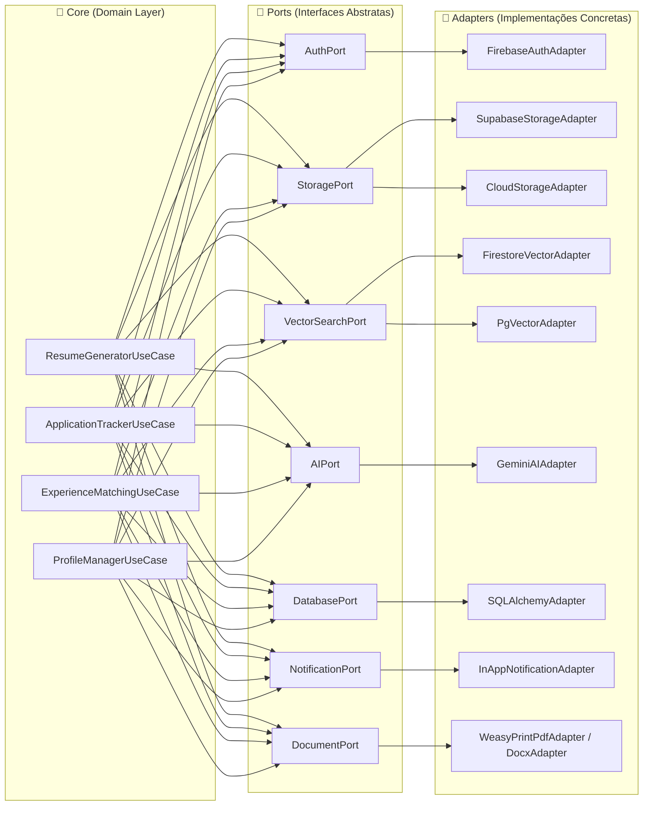
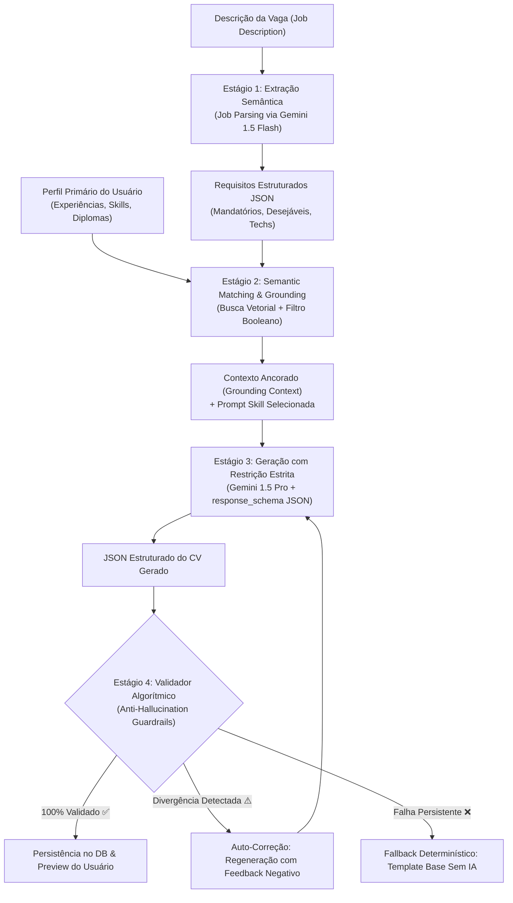
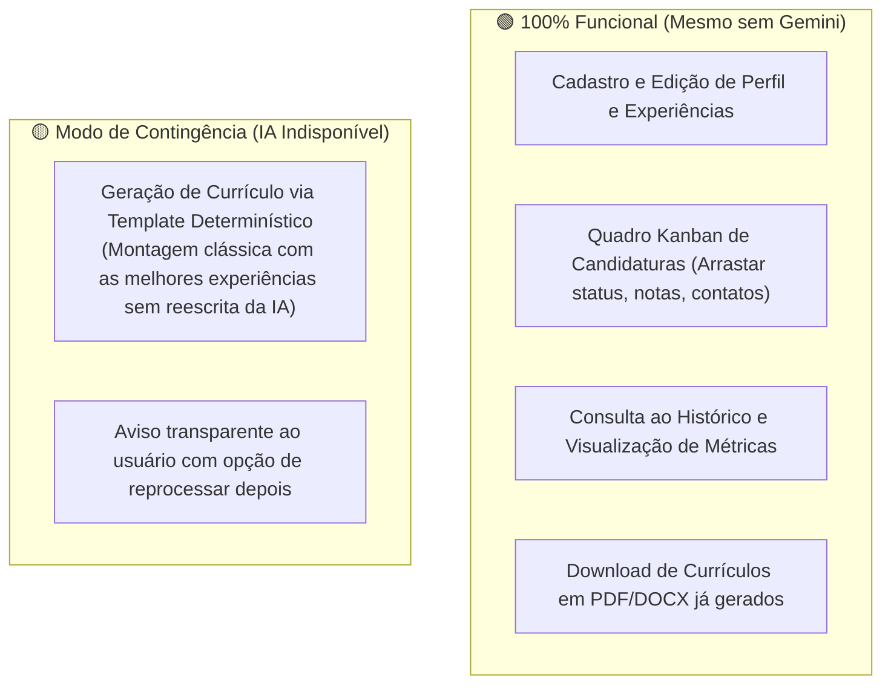
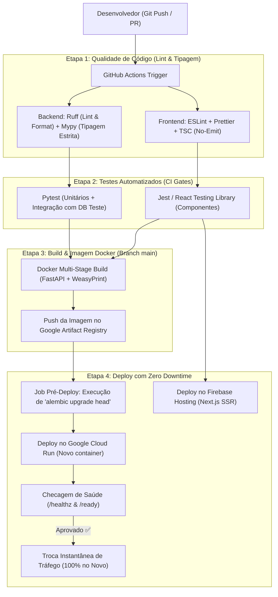
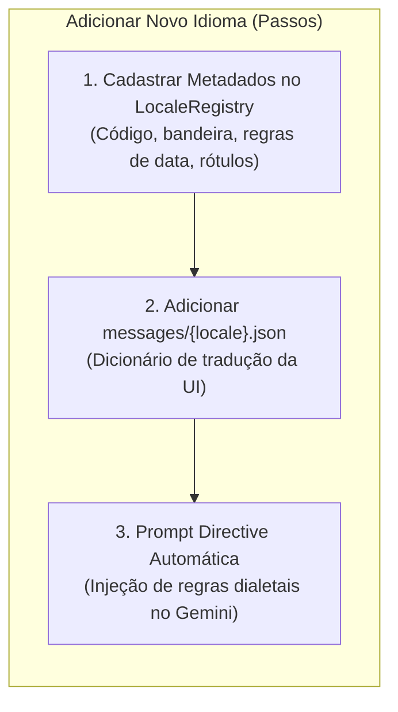
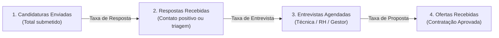
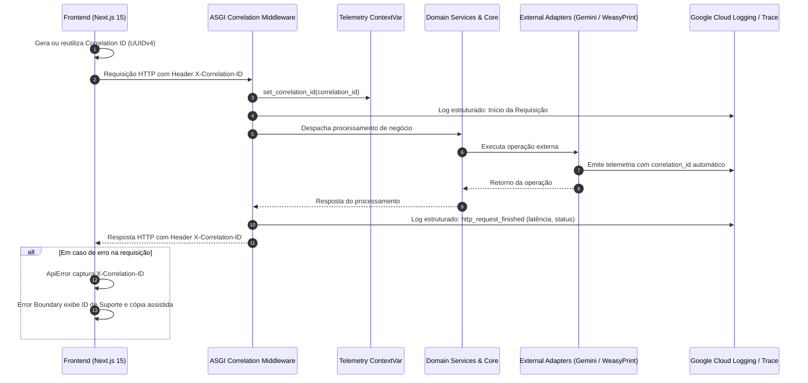

# 📄 PRD — ThothCVs AI: Smarter CV Management

> **Versão:** 1.3  
> **Data:** 2026-09-13  
> **Autor:** Engenharia de Produto & Arquitetura de Software (SRE & Observabilidade)  
> **Status:** Arquitetura de Observabilidade, Tracing Distribuído e Telemetria Concluídas (Seção 23 Adicionada)

---

## 1. Visão do Produto

**ThothCVs AI** é uma plataforma web multi-usuário para gestão inteligente de currículos e acompanhamento de candidaturas a empregos. Inspirado em Thoth — a divindade egípcia da escrita, sabedoria, mensuração e do conhecimento — o sistema permite que o profissional mantenha seu histórico completo de realizações e, a partir de qualquer anúncio de vaga, utilize o **Google Gemini** para gerar currículos sob medida com foco intransigente em **veracidade absoluta**.

Além da geração inteligente, o ThothCVs AI funciona como um **ATS pessoal (Applicant Tracking System)**, permitindo acompanhar o funil completo de seleção, registrar contatos, agendar entrevistas, receber alertas de estagnação (follow-up proativo após 7 dias) e analisar métricas de conversão.

### Proposta de Valor

- **Adaptação Cirúrgica por Oportunidade:** Cada currículo é reestruturado semanticamente para evidenciar os pontos de maior convergência com os requisitos da vaga.
- **Anti-Alucinação e Veracidade Rígida:** A IA sintetiza, reorganiza e estiliza com verbos de ação, mas nunca forja experiências, métricas, certificados ou credenciais não declaradas.
- **ATS Pessoal Integrado:** Registro centralizado de candidaturas, histórico de versões de currículos enviados por vaga, notas de entrevistas e lembretes automáticos.
- **Suporte Multilíngue:** Geração de currículos e cartas de apresentação com fluência nativa no idioma exigido pela vaga.
- **Arquitetura de Custo Mínimo / Zero Inicial:** Máxima exploração do Free Tier do Google Cloud, Supabase e Firebase, permitindo escala inicial sem custos operacionais de infraestrutura.

---

## 2. Decisões Arquiteturais Consolidadas

| Domínio | Decisão Adotada | Justificativa Técnica |
|---|---|---|
| **Padrão Arquitetural** | Hexagonal (Ports & Adapters) + DIP | Desacoplamento total do domínio de negócio em relação a provedores de nuvem, banco e LLM |
| **Frontend** | Next.js 15 (App Router) + Tailwind CSS + shadcn/ui | Suporte SSR nativo, integração com Firebase Hosting / Vercel, componentes acessíveis (Radix UI) |
| **Backend** | FastAPI (Python 3.12+) + Pydantic v2 | Suporte assíncrono nativo para I/O-bound (LLMs e APIs externas), schemas tipados e documentação OpenAPI nativa |
| **ORM & Migrations** | SQLAlchemy 2.0 (Async) + Alembic | Controle rigoroso de transações, migrations versionadas e mapeamento declarativo |
| **Banco Relacional** | PostgreSQL 16+ (Supabase Free Tier) | 500 MB inclusos, suporte a JSONB, integridade referencial e connection pooling (PgBouncer) |
| **Vector Search** | Firestore Vector Search / pgvector | Busca semântica vetorial dos blocos de experiência do usuário versus os requisitos da vaga |
| **Autenticação** | Firebase Auth (Google OAuth 2.0) | Login Google com Free Tier ilimitado, tokens JWT (ID Tokens) validados no backend FastAPI |
| **File Storage** | Supabase Storage (Fase 1) ➔ Cloud Storage (Fase 2) | Armazenamento de PDFs e DOCXs gerados, chaveável via variável de ambiente sem alterar o domínio |
| **Motor de IA** | Google Gemini API (Gemini 1.5 Pro / Flash) | Janela ampla de contexto, modelo de raciocínio rápido e API Key informada pelo usuário (BYOK) |
| **Motor de Renderização** | WeasyPrint (HTML/CSS ➔ PDF) + python-docx (DOCX) | Layout determinístico, qualidade tipográfica para ATS e geração de documentos editáveis |

---

## 3. Arquitetura de Software: Hexagonal (Ports & Adapters)

O sistema segue o princípio de Inversão de Dependência (DIP). O núcleo de negócio não depende de bibliotecas de terceiros ou provedores de nuvem.

### Diagrama de Portas e Adaptadores



### Matriz de Portas e Adaptadores

| Port (Interface) | Responsabilidade | Implementação Fase 1 (MVP) | Implementação Fase 2 (GCP) | Alternativas Futuras |
|---|---|---|---|---|
| `AuthPort` | Verificação criptográfica de tokens e identidade | `FirebaseAuthAdapter` | `FirebaseAuthAdapter` | Auth0, Clerk, Supabase Auth |
| `StoragePort` | Armazenamento e download de documentos gerados | `SupabaseStorageAdapter` | `CloudStorageAdapter` (GCS) | AWS S3, Cloudflare R2 |
| `VectorSearchPort` | Indexação e consulta vetorial por similaridade | `FirestoreVectorAdapter` | `FirestoreVectorAdapter` | `PgVectorAdapter`, Qdrant |
| `AIPort` | Extração de requisitos e reescrita de currículo | `GeminiAIAdapter` | `GeminiAIAdapter` | Anthropic Claude, OpenAI |
| `DatabasePort` | Persistência de dados relacionais transacionais | `SQLAlchemyAdapter` | `SQLAlchemyAdapter` | Qualquer DB compatível |
| `NotificationPort` | Emissão de lembretes e alertas de follow-up | `InAppNotificationAdapter` | `EmailAdapter` (SendGrid/Resend) | Web Push, Telegram Bot |
| `DocumentPort` | Conversão de JSON estruturado em PDF e DOCX | `WeasyPrintAdapter` + `DocxAdapter` | Idem | Typst, LaTeX |

---

## 4. Estratégia de Deploy em Fases

### Fase 1 — MVP sem Cartão de Crédito
- **Frontend:** Vercel (Hobby Tier — CDN global, preview deploys)
- **Backend:** Render ou Railway (Free / Starter container)
- **Banco de Dados & Storage:** Supabase (PostgreSQL 500 MB + Storage 1 GB)
- **Autenticação:** Firebase Auth (Spark Plan gratuito)
- **Vector Search:** Firestore (Spark Plan gratuito)

### Fase 2 — Infraestrutura Google Cloud (com Cartão de Crédito)
- **Frontend:** Firebase Hosting com suporte SSR para Next.js
- **Backend:** Google Cloud Run (Container Serverless, auto-scale to zero, 2M req/mês grátis)
- **Storage:** Google Cloud Storage (Bucket com lifecycle rules)
- **Observabilidade:** Google Cloud Logging & Monitoring
- **Cron Jobs:** Google Cloud Scheduler + Cloud Run Jobs para rotinas de lembretes de 7 dias

---

## 5. Personas e Cenários de Uso

### Persona Principal: O Candidato Estratégico (Tech / Corporate)
- **Perfil:** Profissional que atua nas áreas de Tecnologia, Produto, Design ou Gestão.
- **Dores:**
  - Enviar dezenas de currículos genéricos sem retorno.
  - Perder tempo ajustando manualmente o currículo no Word para cada vaga.
  - Perder o controle de onde se candidatou, em qual etapa está e qual versão do currículo foi enviada.
  - Esquecer de enviar mensagens de follow-up para recrutadores.
  - Receio de usar geradores genéricos de IA que inventam competências inexistentes.
- **Objetivo:** Ter um currículo hiper-focado para cada vaga em menos de 1 minuto, 100% verídico, com registro automático no seu funil de oportunidades.

---

## 6. Funcionalidades Core

### 6.1 Cadastro de Perfil e Repositório de Experiências
O usuário cadastra seu portfólio profissional completo, que serve como fonte primária da verdade:
- **Dados Cadastrais:** Nome, e-mail, telefone, links sociais (LinkedIn, GitHub, Portfólio, Behance) e localização.
- **Experiências Profissionais:** Empresa, cargo, período, modalidade (Remoto/Híbrido/Presencial), descrição de atividades, conquistas quantificáveis (impacto numérico) e stack de tecnologias utilizadas.
- **Formação Acadêmica:** Curso, instituição, grau, período de realização e destaques.
- **Certificações:** Nome da credencial, órgão emissor, data de emissão/expiração e URL de validação.
- **Projetos Pessoais / Open Source:** Nome, descrição, link do repositório/demonstração e tecnologias.
- **Habilidades Técnicas e Idiomas:** Nível de domínio, tempo de experiência e classificação por categorias.

### 6.2 Motor de Geração Inteligente de Currículo (Gemini)
1. **Ingestão da Oportunidade:** O usuário cola a descrição completa da vaga.
2. **Extração Semântica de Requisitos:** O Gemini analisa a vaga e extrai competências mandatórias, desejáveis, nível de senioridade e palavras-chave ATS.
3. **Matching e Re-ranqueamento:** A busca semântica cruza os requisitos da vaga com o repositório de experiências do usuário.
4. **Geração Guiada por Skills (Templates de Tom de Voz):**
   - *Tech Startup:* Ênfase em ownership, entregas ágeis, arquitetura e métricas de escala.
   - *Corporate / Enterprise:* Ênfase em processos, liderança, conformidade e governança.
   - *International:* Formato estrito para EUA/Europa (sem dados sensíveis como foto, idade ou estado civil).
   - *Academic / Research:* Ênfase em publicações, bolsas e rigor metodológico.
5. **Painel de Validação e Match Score:** A UI exibe o currículo lado a lado com a matriz de requisitos da vaga (Atendido ✅, Parcial ⚠️, Não Atendido ❌).
6. **Edição e Exportação:** O usuário pode editar blocos de texto antes de aprovar a exportação em PDF e DOCX.

### 6.3 Gestão de Candidaturas (Application Tracker)
- **Kanban Interativo:** Visualização em colunas por status (`Enviado`, `Respondido`, `Em Processo`, `Entrevista Agendada`, `Esperando Resposta`, `Aprovado`, `Rejeitado`).
- **Histórico de Versões:** Cada candidatura preserva exatamente o JSON e o PDF do currículo que foi enviado naquela ocasião.
- **Etapas do Processo:** Cadastro de etapas dinâmicas (Screening, Teste Técnico, Entrevista Cultural, Proposta).
- **Gestão de Contatos:** Nome, cargo, e-mail, telefone e perfil do LinkedIn de recrutadores e gestores da vaga.
- **Alertas Proativos de Follow-up:** Notificação automática no dashboard quando uma candidatura ultrapassa 7 dias sem atualização de status.

### 6.4 Métricas e Indicadores de Desempenho
- Taxa de conversão de candidaturas enviadas para entrevistas.
- Tempo médio de resposta por empresa.
- Nuvem e ranking de tecnologias mais solicitadas nas vagas aplicadas.
- Gráfico de funil de conversão por etapa do processo seletivo.

---

## 7. Modelo de Dados Relacional Completo (PostgreSQL / Supabase)

O modelo relacional foi desenhado para garantir integridade referencial rígida, histórico imutável das versões geradas, suporte a multi-tenancy estrito por `user_id` e compatibilidade total com o PostgreSQL 16+.

### 7.1 Diagrama Entidade-Relacionamento Unificado

```mermaid
erDiagram
    USERS ||--o{ EXPERIENCES : owns
    USERS ||--o{ EDUCATIONS : owns
    USERS ||--o{ CERTIFICATIONS : owns
    USERS ||--o{ PROJECTS : owns
    USERS ||--o{ SKILLS : owns
    USERS ||--o{ LANGUAGES : owns
    USERS ||--|| USER_SETTINGS : configures
    USERS ||--o{ APPLICATIONS : tracks
    USERS ||--o{ NOTIFICATIONS : receives
    USERS ||--o{ PROMPT_SKILLS : creates_custom

    APPLICATIONS ||--o{ APPLICATION_STAGES : contains
    APPLICATIONS ||--o{ APPLICATION_CONTACTS : contains
    APPLICATIONS ||--o{ APPLICATION_NOTES : contains
    APPLICATIONS ||--o{ GENERATED_RESUMES : generates
    APPLICATIONS ||--o{ COVER_LETTERS : generates
    APPLICATIONS ||--o{ NOTIFICATIONS : triggers

    PROMPT_SKILLS ||--o{ GENERATED_RESUMES : styles

    USERS {
        uuid id PK
        string firebase_uid UK
        string email UK
        string full_name
        string phone
        string location
        string linkedin_url
        string github_url
        string portfolio_url
        text professional_summary
        string target_title
        boolean is_active
        timestamp created_at
        timestamp updated_at
        timestamp deleted_at
    }

    USER_SETTINGS {
        uuid id PK
        uuid user_id FK
        text encrypted_gemini_api_key
        string preferred_language
        string default_prompt_skill_id
        boolean email_notifications_enabled
        boolean in_app_notifications_enabled
        timestamp created_at
        timestamp updated_at
    }

    EXPERIENCES {
        uuid id PK
        uuid user_id FK
        string company_name
        string position_title
        string location
        string work_model
        date start_date
        date end_date
        boolean is_current
        text description
        jsonb bullet_points
        jsonb tech_stack
        jsonb quantifiable_results
        int sort_order
        timestamp created_at
        timestamp updated_at
        timestamp deleted_at
    }

    EDUCATIONS {
        uuid id PK
        uuid user_id FK
        string institution_name
        string degree
        string field_of_study
        date start_date
        date end_date
        boolean is_current
        text description
        int sort_order
        timestamp created_at
        timestamp updated_at
        timestamp deleted_at
    }

    CERTIFICATIONS {
        uuid id PK
        uuid user_id FK
        string name
        string issuing_organization
        date issue_date
        date expiration_date
        string credential_id
        string credential_url
        int sort_order
        timestamp created_at
        timestamp updated_at
        timestamp deleted_at
    }

    PROJECTS {
        uuid id PK
        uuid user_id FK
        string title
        text description
        string role
        jsonb technologies
        string repository_url
        string live_url
        date start_date
        date end_date
        int sort_order
        timestamp created_at
        timestamp updated_at
        timestamp deleted_at
    }

    SKILLS {
        uuid id PK
        uuid user_id FK
        string name
        string category
        string proficiency_level
        int years_of_experience
        boolean is_featured
        timestamp created_at
        timestamp updated_at
    }

    LANGUAGES {
        uuid id PK
        uuid user_id FK
        string language_name
        string proficiency_level
        timestamp created_at
        timestamp updated_at
    }

    PROMPT_SKILLS {
        uuid id PK
        string slug UK
        string name
        string description
        string category
        text system_prompt
        string default_language
        boolean is_system_default
        uuid created_by_user_id FK
        boolean is_active
        timestamp created_at
        timestamp updated_at
    }

    APPLICATIONS {
        uuid id PK
        uuid user_id FK
        string company_name
        string job_title
        string job_url
        text job_description
        string salary_range
        string location
        string work_model
        string status
        date applied_at
        timestamp last_activity_at
        date next_follow_up_date
        boolean reminder_active
        timestamp created_at
        timestamp updated_at
        timestamp deleted_at
    }

    APPLICATION_STAGES {
        uuid id PK
        uuid application_id FK
        string stage_name
        string status
        timestamp scheduled_at
        timestamp completed_at
        text feedback_notes
        int order_index
        timestamp created_at
        timestamp updated_at
    }

    APPLICATION_CONTACTS {
        uuid id PK
        uuid application_id FK
        string full_name
        string role_type
        string email
        string linkedin_url
        string phone
        text context_notes
        timestamp created_at
        timestamp updated_at
    }

    APPLICATION_NOTES {
        uuid id PK
        uuid application_id FK
        text content
        string note_type
        timestamp created_at
        timestamp updated_at
    }

    GENERATED_RESUMES {
        uuid id PK
        uuid application_id FK
        uuid user_id FK
        uuid prompt_skill_id FK
        string language
        int version_number
        jsonb structured_content
        jsonb match_analysis
        float match_percentage
        string pdf_storage_path
        string docx_storage_path
        timestamp created_at
        timestamp updated_at
    }

    COVER_LETTERS {
        uuid id PK
        uuid application_id FK
        uuid user_id FK
        text content
        string language
        string storage_path
        timestamp created_at
        timestamp updated_at
    }

    NOTIFICATIONS {
        uuid id PK
        uuid user_id FK
        uuid application_id FK
        string notification_type
        string title
        text message
        boolean is_read
        timestamp scheduled_for
        timestamp sent_at
        timestamp created_at
    }
```



---

### 7.2 Especificação Detalhada das Tabelas

#### Tabela: `users`
Armazena a entidade principal do usuário autenticado via Firebase Auth.

| Coluna | Tipo SQL | Modificadores | Descrição |
|---|---|---|---|
| `id` | `UUID` | `PRIMARY KEY DEFAULT gen_random_uuid()` | Identificador interno |
| `firebase_uid` | `VARCHAR(128)` | `NOT NULL UNIQUE` | UID de autenticação do Firebase |
| `email` | `VARCHAR(255)` | `NOT NULL UNIQUE` | E-mail principal do usuário |
| `full_name` | `VARCHAR(150)` | `NOT NULL` | Nome completo para o cabeçalho do CV |
| `phone` | `VARCHAR(30)` | `NULL` | Telefone com DDI/DDD |
| `location` | `VARCHAR(100)` | `NULL` | Cidade, Estado, País (ex: "São Paulo, SP - Brasil") |
| `linkedin_url` | `VARCHAR(255)` | `NULL` | Link público do LinkedIn |
| `github_url` | `VARCHAR(255)` | `NULL` | Link público do GitHub |
| `portfolio_url` | `VARCHAR(255)` | `NULL` | Link de site/portfólio pessoal |
| `professional_summary` | `TEXT` | `NULL` | Resumo base de apresentação |
| `target_title` | `VARCHAR(100)` | `NULL` | Cargo ou área pretendida principal |
| `is_active` | `BOOLEAN` | `NOT NULL DEFAULT TRUE` | Status da conta |
| `created_at` | `TIMESTAMPTZ` | `NOT NULL DEFAULT NOW()` | Data de criação |
| `updated_at` | `TIMESTAMPTZ` | `NOT NULL DEFAULT NOW()` | Última atualização |
| `deleted_at` | `TIMESTAMPTZ` | `NULL` | Data de exclusão lógica (Soft delete) |

---

#### Tabela: `user_settings`
Configurações individuais e credenciais criptografadas do usuário.

| Coluna | Tipo SQL | Modificadores | Descrição |
|---|---|---|---|
| `id` | `UUID` | `PRIMARY KEY DEFAULT gen_random_uuid()` | Identificador único |
| `user_id` | `UUID` | `NOT NULL UNIQUE REFERENCES users(id) ON DELETE CASCADE` | Chave estrangeira do usuário |
| `encrypted_gemini_api_key` | `TEXT` | `NULL` | API Key do Gemini criptografada (AES-GCM-256) |
| `preferred_language` | `VARCHAR(10)` | `NOT NULL DEFAULT 'pt-BR'` | Idioma padrão da UI |
| `default_prompt_skill_id` | `UUID` | `NULL REFERENCES prompt_skills(id)` | Skill favorita padrão |
| `email_notifications_enabled`| `BOOLEAN` | `NOT NULL DEFAULT TRUE` | Receber e-mails de alerta |
| `in_app_notifications_enabled`| `BOOLEAN`| `NOT NULL DEFAULT TRUE` | Exibir alertas na interface |
| `created_at` | `TIMESTAMPTZ` | `NOT NULL DEFAULT NOW()` | Data de criação |
| `updated_at` | `TIMESTAMPTZ` | `NOT NULL DEFAULT NOW()` | Última atualização |

---

#### Tabela: `experiences`
Repositório central de experiências profissionais do usuário.

| Coluna | Tipo SQL | Modificadores | Descrição |
|---|---|---|---|
| `id` | `UUID` | `PRIMARY KEY DEFAULT gen_random_uuid()` | Identificador |
| `user_id` | `UUID` | `NOT NULL REFERENCES users(id) ON DELETE CASCADE` | Dono da experiência |
| `company_name` | `VARCHAR(150)` | `NOT NULL` | Nome da empresa |
| `position_title` | `VARCHAR(120)` | `NOT NULL` | Cargo ocupado |
| `location` | `VARCHAR(100)` | `NULL` | Localização da empresa |
| `work_model` | `VARCHAR(20)` | `NOT NULL DEFAULT 'remote'` | `'remote'`, `'hybrid'`, `'on-site'` |
| `start_date` | `DATE` | `NOT NULL` | Data de início |
| `end_date` | `DATE` | `NULL` | Data de término (`NULL` se atual) |
| `is_current` | `BOOLEAN` | `NOT NULL DEFAULT FALSE` | Flag de trabalho corrente |
| `description` | `TEXT` | `NOT NULL` | Descrição narrativa detalhada das atividades |
| `bullet_points` | `JSONB` | `NOT NULL DEFAULT '[]'` | Lista de realizações destacadas |
| `tech_stack` | `JSONB` | `NOT NULL DEFAULT '[]'` | Lista de tags de tecnologias utilizadas |
| `quantifiable_results` | `JSONB` | `NOT NULL DEFAULT '[]'` | Métricas mensuráveis (ex: "Reduziu latência em 40%") |
| `sort_order` | `INT` | `NOT NULL DEFAULT 0` | Ordem de exibição manual |
| `created_at` | `TIMESTAMPTZ` | `NOT NULL DEFAULT NOW()` | Data de criação |
| `updated_at` | `TIMESTAMPTZ` | `NOT NULL DEFAULT NOW()` | Data de atualização |
| `deleted_at` | `TIMESTAMPTZ` | `NULL` | Soft delete |

---

#### Tabela: `educations`
Formação acadêmica e cursos superiores.

| Coluna | Tipo SQL | Modificadores | Descrição |
|---|---|---|---|
| `id` | `UUID` | `PRIMARY KEY DEFAULT gen_random_uuid()` | Identificador |
| `user_id` | `UUID` | `NOT NULL REFERENCES users(id) ON DELETE CASCADE` | Dono do registro |
| `institution_name` | `VARCHAR(150)` | `NOT NULL` | Universidade / Instituição |
| `degree` | `VARCHAR(100)` | `NOT NULL` | Bacharelado, Pós-graduação, Mestrado, etc. |
| `field_of_study` | `VARCHAR(150)` | `NOT NULL` | Curso / Especialidade |
| `start_date` | `DATE` | `NOT NULL` | Início |
| `end_date` | `DATE` | `NULL` | Fim |
| `is_current` | `BOOLEAN` | `NOT NULL DEFAULT FALSE` | Se ainda está cursando |
| `description` | `TEXT` | `NULL` | TCC, honras ou atividades |
| `sort_order` | `INT` | `NOT NULL DEFAULT 0` | Ordem de exibição |
| `created_at` | `TIMESTAMPTZ` | `NOT NULL DEFAULT NOW()` | Data de criação |
| `updated_at` | `TIMESTAMPTZ` | `NOT NULL DEFAULT NOW()` | Data de atualização |
| `deleted_at` | `TIMESTAMPTZ` | `NULL` | Soft delete |

---

#### Tabela: `certifications`
Certificações técnicas e licenças profissionais.

| Coluna | Tipo SQL | Modificadores | Descrição |
|---|---|---|---|
| `id` | `UUID` | `PRIMARY KEY DEFAULT gen_random_uuid()` | Identificador |
| `user_id` | `UUID` | `NOT NULL REFERENCES users(id) ON DELETE CASCADE` | Usuário |
| `name` | `VARCHAR(150)` | `NOT NULL` | Título da certificação (ex: AWS SAA-C03) |
| `issuing_organization` | `VARCHAR(150)` | `NOT NULL` | Entidade emissora (ex: Amazon Web Services) |
| `issue_date` | `DATE` | `NOT NULL` | Data de obtenção |
| `expiration_date` | `DATE` | `NULL` | Data de expiração (`NULL` se vitalícia) |
| `credential_id` | `VARCHAR(100)` | `NULL` | Código verificador |
| `credential_url` | `VARCHAR(255)` | `NULL` | Link de validação online |
| `sort_order` | `INT` | `NOT NULL DEFAULT 0` | Ordem de exibição |
| `created_at` | `TIMESTAMPTZ` | `NOT NULL DEFAULT NOW()` | Criação |
| `updated_at` | `TIMESTAMPTZ` | `NOT NULL DEFAULT NOW()` | Atualização |
| `deleted_at` | `TIMESTAMPTZ` | `NULL` | Soft delete |

---

#### Tabela: `projects`
Projetos pessoais, portfólio prático e iniciativas open source.

| Coluna | Tipo SQL | Modificadores | Descrição |
|---|---|---|---|
| `id` | `UUID` | `PRIMARY KEY DEFAULT gen_random_uuid()` | Identificador |
| `user_id` | `UUID` | `NOT NULL REFERENCES users(id) ON DELETE CASCADE` | Usuário |
| `title` | `VARCHAR(150)` | `NOT NULL` | Título do projeto |
| `description` | `TEXT` | `NOT NULL` | Objetivo e resultados do projeto |
| `role` | `VARCHAR(100)` | `NULL` | Papel exercido |
| `technologies` | `JSONB` | `NOT NULL DEFAULT '[]'` | Lista de tecnologias aplicadas |
| `repository_url` | `VARCHAR(255)` | `NULL` | Link do repositório (GitHub, etc.) |
| `live_url` | `VARCHAR(255)` | `NULL` | Link em produção / Demo |
| `start_date` | `DATE` | `NULL` | Data de início |
| `end_date` | `DATE` | `NULL` | Data de conclusão |
| `sort_order` | `INT` | `NOT NULL DEFAULT 0` | Ordem |
| `created_at` | `TIMESTAMPTZ` | `NOT NULL DEFAULT NOW()` | Criação |
| `updated_at` | `TIMESTAMPTZ` | `NOT NULL DEFAULT NOW()` | Atualização |
| `deleted_at` | `TIMESTAMPTZ` | `NULL` | Soft delete |

---

#### Tabela: `skills`
Inventário de competências técnicas e comportamentais do usuário.

| Coluna | Tipo SQL | Modificadores | Descrição |
|---|---|---|---|
| `id` | `UUID` | `PRIMARY KEY DEFAULT gen_random_uuid()` | Identificador |
| `user_id` | `UUID` | `NOT NULL REFERENCES users(id) ON DELETE CASCADE` | Usuário |
| `name` | `VARCHAR(100)` | `NOT NULL` | Nome da habilidade (ex: "FastAPI", "Docker") |
| `category` | `VARCHAR(50)` | `NOT NULL DEFAULT 'backend'` | Categoria (`backend`, `frontend`, `cloud`, etc.) |
| `proficiency_level` | `VARCHAR(30)` | `NOT NULL DEFAULT 'intermediate'` | `'beginner'`, `'intermediate'`, `'advanced'`, `'expert'` |
| `years_of_experience` | `INT` | `NOT NULL DEFAULT 1` | Anos de prática comprovada |
| `is_featured` | `BOOLEAN` | `NOT NULL DEFAULT FALSE` | Destaque no topo do perfil |
| `created_at` | `TIMESTAMPTZ` | `NOT NULL DEFAULT NOW()` | Criação |
| `updated_at` | `TIMESTAMPTZ` | `NOT NULL DEFAULT NOW()` | Atualização |

---

#### Tabela: `languages`
Idiomas e níveis de fluência falados pelo candidato.

| Coluna | Tipo SQL | Modificadores | Descrição |
|---|---|---|---|
| `id` | `UUID` | `PRIMARY KEY DEFAULT gen_random_uuid()` | Identificador |
| `user_id` | `UUID` | `NOT NULL REFERENCES users(id) ON DELETE CASCADE` | Usuário |
| `language_name` | `VARCHAR(50)` | `NOT NULL` | Nome do idioma (ex: "Inglês", "Espanhol") |
| `proficiency_level` | `VARCHAR(30)` | `NOT NULL` | `'basic'`, `'intermediate'`, `'advanced'`, `'fluent'`, `'native'` |
| `created_at` | `TIMESTAMPTZ` | `NOT NULL DEFAULT NOW()` | Criação |
| `updated_at` | `TIMESTAMPTZ` | `NOT NULL DEFAULT NOW()` | Atualização |

---

#### Tabela: `prompt_skills`
Templates de personas e diretrizes de prompt para o Gemini.

| Coluna | Tipo SQL | Modificadores | Descrição |
|---|---|---|---|
| `id` | `UUID` | `PRIMARY KEY DEFAULT gen_random_uuid()` | Identificador |
| `slug` | `VARCHAR(50)` | `NOT NULL UNIQUE` | Identificador textual (`tech-startup`, `corporate`) |
| `name` | `VARCHAR(100)` | `NOT NULL` | Nome legível na UI |
| `description` | `VARCHAR(255)` | `NOT NULL` | Explicação de quando usar |
| `category` | `VARCHAR(50)` | `NOT NULL DEFAULT 'general'` | Classificação da skill |
| `system_prompt` | `TEXT` | `NOT NULL` | Instruções detalhadas para o Gemini |
| `default_language` | `VARCHAR(10)` | `NOT NULL DEFAULT 'pt-BR'` | Idioma sugerido |
| `is_system_default`| `BOOLEAN` | `NOT NULL DEFAULT FALSE` | Se é padrão do sistema (read-only) |
| `created_by_user_id`| `UUID` | `NULL REFERENCES users(id) ON DELETE SET NULL` | Se for customizada pelo usuário |
| `is_active` | `BOOLEAN` | `NOT NULL DEFAULT TRUE` | Ativação |
| `created_at` | `TIMESTAMPTZ` | `NOT NULL DEFAULT NOW()` | Criação |
| `updated_at` | `TIMESTAMPTZ` | `NOT NULL DEFAULT NOW()` | Atualização |

---

#### Tabela: `applications`
Entidade central do ATS: registro de cada candidatura realizada.

| Coluna | Tipo SQL | Modificadores | Descrição |
|---|---|---|---|
| `id` | `UUID` | `PRIMARY KEY DEFAULT gen_random_uuid()` | Identificador |
| `user_id` | `UUID` | `NOT NULL REFERENCES users(id) ON DELETE CASCADE` | Usuário candidato |
| `company_name` | `VARCHAR(150)` | `NOT NULL` | Nome da empresa contratante |
| `job_title` | `VARCHAR(120)` | `NOT NULL` | Título da vaga pretendida |
| `job_url` | `VARCHAR(500)` | `NULL` | Link do anúncio original da vaga |
| `job_description` | `TEXT` | `NOT NULL` | Texto integral da descrição da vaga |
| `salary_range` | `VARCHAR(80)` | `NULL` | Pretensão ou faixa declarada |
| `location` | `VARCHAR(100)` | `NULL` | Cidade / País da vaga |
| `work_model` | `VARCHAR(20)` | `NOT NULL DEFAULT 'remote'` | `'remote'`, `'hybrid'`, `'on-site'` |
| `status` | `VARCHAR(30)` | `NOT NULL DEFAULT 'applied'` | `'applied'`, `'responded'`, `'in_process'`, `'interview_scheduled'`, `'waiting_feedback'`, `'accepted'`, `'rejected'` |
| `applied_at` | `DATE` | `NOT NULL DEFAULT CURRENT_DATE` | Data de submissão do currículo |
| `last_activity_at` | `TIMESTAMPTZ` | `NOT NULL DEFAULT NOW()` | Timestamp da última interação (alimenta alertas de 7 dias) |
| `next_follow_up_date`| `DATE` | `NULL` | Data planejada para follow-up manual |
| `reminder_active` | `BOOLEAN` | `NOT NULL DEFAULT TRUE` | Ativação dos lembretes automáticos |
| `created_at` | `TIMESTAMPTZ` | `NOT NULL DEFAULT NOW()` | Criação |
| `updated_at` | `TIMESTAMPTZ` | `NOT NULL DEFAULT NOW()` | Atualização |
| `deleted_at` | `TIMESTAMPTZ` | `NULL` | Soft delete |

---

#### Tabela: `application_stages`
Etapas sequenciais ou marcos do processo seletivo de uma candidatura.

| Coluna | Tipo SQL | Modificadores | Descrição |
|---|---|---|---|
| `id` | `UUID` | `PRIMARY KEY DEFAULT gen_random_uuid()` | Identificador |
| `application_id` | `UUID` | `NOT NULL REFERENCES applications(id) ON DELETE CASCADE` | Candidatura pai |
| `stage_name` | `VARCHAR(100)` | `NOT NULL` | Nome da fase (ex: "Triagem RH", "Live Coding") |
| `status` | `VARCHAR(30)` | `NOT NULL DEFAULT 'pending'` | `'pending'`, `'scheduled'`, `'completed'`, `'skipped'` |
| `scheduled_at` | `TIMESTAMPTZ` | `NULL` | Data e hora marcada |
| `completed_at` | `TIMESTAMPTZ` | `NULL` | Data de conclusão da etapa |
| `feedback_notes` | `TEXT` | `NULL` | Retorno recebido ou impressões |
| `order_index` | `INT` | `NOT NULL DEFAULT 0` | Sequência ordinal no funil |
| `created_at` | `TIMESTAMPTZ` | `NOT NULL DEFAULT NOW()` | Criação |
| `updated_at` | `TIMESTAMPTZ` | `NOT NULL DEFAULT NOW()` | Atualização |

---

#### Tabela: `application_contacts`
Pessoas de contato associadas ao processo seletivo.

| Coluna | Tipo SQL | Modificadores | Descrição |
|---|---|---|---|
| `id` | `UUID` | `PRIMARY KEY DEFAULT gen_random_uuid()` | Identificador |
| `application_id` | `UUID` | `NOT NULL REFERENCES applications(id) ON DELETE CASCADE` | Candidatura pai |
| `full_name` | `VARCHAR(120)` | `NOT NULL` | Nome do profissional |
| `role_type` | `VARCHAR(30)` | `NOT NULL DEFAULT 'recruiter'` | `'recruiter'`, `'hiring_manager'`, `'tech_interviewer'`, `'referral'`, `'other'` |
| `email` | `VARCHAR(255)` | `NULL` | E-mail de contato |
| `linkedin_url` | `VARCHAR(255)` | `NULL` | LinkedIn do contato |
| `phone` | `VARCHAR(30)` | `NULL` | Telefone / WhatsApp |
| `context_notes` | `TEXT` | `NULL` | Anotações sobre o contato |
| `created_at` | `TIMESTAMPTZ` | `NOT NULL DEFAULT NOW()` | Criação |
| `updated_at` | `TIMESTAMPTZ` | `NOT NULL DEFAULT NOW()` | Atualização |

---

#### Tabela: `application_notes`
Bloco de notas cronológico para registro de informações livres da vaga.

| Coluna | Tipo SQL | Modificadores | Descrição |
|---|---|---|---|
| `id` | `UUID` | `PRIMARY KEY DEFAULT gen_random_uuid()` | Identificador |
| `application_id` | `UUID` | `NOT NULL REFERENCES applications(id) ON DELETE CASCADE` | Candidatura |
| `content` | `TEXT` | `NOT NULL` | Texto da anotação |
| `note_type` | `VARCHAR(30)` | `NOT NULL DEFAULT 'general'` | `'general'`, `'interview_prep'`, `'salary_negotiation'`, `'rejection_reason'` |
| `created_at` | `TIMESTAMPTZ` | `NOT NULL DEFAULT NOW()` | Criação |
| `updated_at` | `TIMESTAMPTZ` | `NOT NULL DEFAULT NOW()` | Atualização |

---

#### Tabela: `generated_resumes`
Preservação histórica exata de cada versão do currículo gerada para a vaga.

| Coluna | Tipo SQL | Modificadores | Descrição |
|---|---|---|---|
| `id` | `UUID` | `PRIMARY KEY DEFAULT gen_random_uuid()` | Identificador |
| `application_id` | `UUID` | `NOT NULL REFERENCES applications(id) ON DELETE CASCADE` | Candidatura associada |
| `user_id` | `UUID` | `NOT NULL REFERENCES users(id) ON DELETE CASCADE` | Dono |
| `prompt_skill_id`| `UUID` | `NULL REFERENCES prompt_skills(id)` | Template de prompt aplicado |
| `language` | `VARCHAR(10)` | `NOT NULL DEFAULT 'pt-BR'` | Idioma do currículo gerado |
| `version_number` | `INT` | `NOT NULL DEFAULT 1` | Número incremental da versão |
| `structured_content`| `JSONB` | `NOT NULL` | JSON completo do CV gerado (usado no preview e edição) |
| `match_analysis` | `JSONB` | `NOT NULL DEFAULT '{}'` | Detalhamento dos requisitos atendidos / não atendidos |
| `match_percentage`| `FLOAT` | `NOT NULL DEFAULT 0.0` | Pontuação global de aderência (0.0 a 100.0%) |
| `pdf_storage_path`| `VARCHAR(500)` | `NULL` | Caminho do arquivo PDF no Storage |
| `docx_storage_path`| `VARCHAR(500)`| `NULL` | Caminho do arquivo DOCX no Storage |
| `created_at` | `TIMESTAMPTZ` | `NOT NULL DEFAULT NOW()` | Criação |
| `updated_at` | `TIMESTAMPTZ` | `NOT NULL DEFAULT NOW()` | Atualização |

---

#### Tabela: `cover_letters`
Carta de apresentação opcional gerada para acompanhar a candidatura.

| Coluna | Tipo SQL | Modificadores | Descrição |
|---|---|---|---|
| `id` | `UUID` | `PRIMARY KEY DEFAULT gen_random_uuid()` | Identificador |
| `application_id` | `UUID` | `NOT NULL REFERENCES applications(id) ON DELETE CASCADE` | Candidatura pai |
| `user_id` | `UUID` | `NOT NULL REFERENCES users(id) ON DELETE CASCADE` | Dono |
| `content` | `TEXT` | `NOT NULL` | Texto integral da carta |
| `language` | `VARCHAR(10)` | `NOT NULL DEFAULT 'pt-BR'` | Idioma do texto |
| `storage_path` | `VARCHAR(500)` | `NULL` | Caminho do arquivo PDF gerado |
| `created_at` | `TIMESTAMPTZ` | `NOT NULL DEFAULT NOW()` | Criação |
| `updated_at` | `TIMESTAMPTZ` | `NOT NULL DEFAULT NOW()` | Atualização |

---

#### Tabela: `notifications`
Fila de notificações in-app e histórico de e-mails de alerta.

| Coluna | Tipo SQL | Modificadores | Descrição |
|---|---|---|---|
| `id` | `UUID` | `PRIMARY KEY DEFAULT gen_random_uuid()` | Identificador |
| `user_id` | `UUID` | `NOT NULL REFERENCES users(id) ON DELETE CASCADE` | Destinatário |
| `application_id` | `UUID` | `NULL REFERENCES applications(id) ON DELETE SET NULL` | Vaga relacionada (se aplicável) |
| `notification_type`| `VARCHAR(40)` | `NOT NULL DEFAULT 'follow_up_reminder'` | `'follow_up_reminder'`, `'interview_alert'`, `'weekly_digest'`, `'system'` |
| `title` | `VARCHAR(150)` | `NOT NULL` | Título curto da notificação |
| `message` | `TEXT` | `NOT NULL` | Corpo do aviso |
| `is_read` | `BOOLEAN` | `NOT NULL DEFAULT FALSE` | Se já foi visualizada na UI |
| `scheduled_for` | `TIMESTAMPTZ` | `NOT NULL DEFAULT NOW()` | Momento ideal para envio |
| `sent_at` | `TIMESTAMPTZ` | `NULL` | Momento em que foi disparada |
| `created_at` | `TIMESTAMPTZ` | `NOT NULL DEFAULT NOW()` | Criação |

---

### 7.3 Índices Estratégicos Recomendados (Performance e Custos)

Para evitar full table scans e manter as consultas sob 10ms:

```sql
-- Busca rápida de usuário por UID Firebase na autenticação de cada request
CREATE UNIQUE INDEX idx_users_firebase_uid ON users(firebase_uid) WHERE deleted_at IS NULL;

-- Consultas de listagem do perfil ordenado
CREATE INDEX idx_experiences_user_sort ON experiences(user_id, sort_order ASC) WHERE deleted_at IS NULL;
CREATE INDEX idx_educations_user_sort ON educations(user_id, sort_order ASC) WHERE deleted_at IS NULL;
CREATE INDEX idx_certifications_user_sort ON certifications(user_id, sort_order ASC) WHERE deleted_at IS NULL;
CREATE INDEX idx_projects_user_sort ON projects(user_id, sort_order ASC) WHERE deleted_at IS NULL;
CREATE INDEX idx_skills_user_category ON skills(user_id, category);

-- Consultas do Kanban e Listagem de Candidaturas (filtros por usuário e status)
CREATE INDEX idx_applications_user_status ON applications(user_id, status) WHERE deleted_at IS NULL;

-- Query do cron job de lembretes de 7 dias (alta criticidade para performance)
CREATE INDEX idx_applications_followup ON applications(user_id, last_activity_at, reminder_active) 
WHERE status NOT IN ('accepted', 'rejected') AND deleted_at IS NULL;

-- Busca rápida de versões de currículos por vaga
CREATE INDEX idx_resumes_application ON generated_resumes(application_id, version_number DESC);

-- Notificações não lidas do usuário
CREATE INDEX idx_notifications_user_unread ON notifications(user_id, is_read, scheduled_for DESC);
```

### 7.4 Políticas de Deleção: Soft Delete vs Hard Delete

1. **Soft Delete (`deleted_at`):** Aplicado em `users`, `experiences`, `educations`, `certifications`, `projects` e `applications`.
   - *Motivação:* Protege contra deleções acidentais de históricos profissionais valiosos e mantém a consistência histórica de métricas de conversão.
   - *Comportamento:* Todas as queries padrão filtram automaticamente `WHERE deleted_at IS NULL`.
2. **Hard Delete (GDPR / LGPD Compliance):**
   - Quando o usuário solicitar a **Exclusão Definitiva da Conta** nas configurações, uma rotina administrativa executa o `DELETE FROM users WHERE id = :user_id`. Todas as tabelas filhas possuem constraints `ON DELETE CASCADE`, garantindo a remoção em cascata e purga dos arquivos associados no Storage.

---

## 8. Especificação de Contratos de API (REST)

A API do ThothCVs é versionada sob o prefixo `/api/v1` e segue estritamente as convenções RESTful com transporte via HTTPS e serialização em JSON.

### 8.1 Padrões Globais da API

#### Autenticação e Headers
Todas as requisições autenticadas exigem o cabeçalho HTTP:
```http
Authorization: Bearer <firebase_id_token>
Content-Type: application/json
```

#### Formato Padronizado de Resposta de Erro (RFC 7807 Adaptado)
```json
{
  "error": {
    "code": "RESOURCE_NOT_FOUND",
    "message": "A candidatura especificada não foi encontrada ou não pertence ao usuário.",
    "details": [],
    "timestamp": "2026-09-09T17:00:00Z"
  }
}
```

#### Formato Padronizado de Paginação
```json
{
  "items": [],
  "total": 45,
  "page": 1,
  "page_size": 20,
  "total_pages": 3
}
```

---

### 8.2 Matriz Completa de Endpoints

#### Módulo: Autenticação & Conta (`/api/v1/auth`, `/api/v1/users`)

| Método | Rota | Descrição | Status Sucesso | Auth |
|---|---|---|---|---|
| `POST` | `/api/v1/auth/sync` | Valida o token Firebase e efetua upsert do usuário no PostgreSQL | `200 OK` | Sim |
| `GET` | `/api/v1/users/me` | Retorna o perfil básico do usuário logado | `200 OK` | Sim |
| `PUT` | `/api/v1/users/me` | Atualiza nome, telefone, links sociais e cargo pretendido | `200 OK` | Sim |
| `DELETE` | `/api/v1/users/me` | Exclusão definitiva da conta e dados em cascata (LGPD/GDPR) | `204 No Content` | Sim |
| `GET` | `/api/v1/users/me/settings` | Retorna preferências (sem expor a chave Gemini decifrada) | `200 OK` | Sim |
| `PUT` | `/api/v1/users/me/settings` | Atualiza preferências e cifra a API key do Gemini | `200 OK` | Sim |

##### Exemplo de Payload: `PUT /api/v1/users/me/settings`
```json
{
  "gemini_api_key": "AIzaSyD-EXAMPLE_KEY_12345",
  "preferred_language": "pt-BR",
  "default_prompt_skill_id": "3fa85f64-5717-4562-b3fc-2c963f66afa6",
  "email_notifications_enabled": true,
  "in_app_notifications_enabled": true
}
```

---

#### Módulo: Repositório Profissional (`/api/v1/profile`)

| Método | Rota | Descrição | Status Sucesso |
|---|---|---|---|
| `GET` | `/api/v1/profile/full` | Retorna o dossiê profissional completo (todas as seções) | `200 OK` |
| `GET` | `/api/v1/profile/experiences` | Lista experiências ativas ordenadas por `sort_order` | `200 OK` |
| `POST` | `/api/v1/profile/experiences` | Cadastra uma nova experiência profissional | `201 Created` |
| `PUT` | `/api/v1/profile/experiences/{id}` | Edita uma experiência existente | `200 OK` |
| `DELETE` | `/api/v1/profile/experiences/{id}` | Soft delete de uma experiência | `204 No Content` |
| `POST` | `/api/v1/profile/experiences/reorder` | Atualiza a ordenação manual das experiências | `200 OK` |
| `GET/POST` | `/api/v1/profile/educations` | Lista e cria registros acadêmicos | `200 / 201` |
| `PUT/DELETE` | `/api/v1/profile/educations/{id}` | Edita e remove registros acadêmicos | `200 / 204` |
| `GET/POST` | `/api/v1/profile/certifications` | Lista e cria certificações | `200 / 201` |
| `PUT/DELETE` | `/api/v1/profile/certifications/{id}` | Edita e remove certificações | `200 / 204` |
| `GET/POST` | `/api/v1/profile/projects` | Lista e cria projetos | `200 / 201` |
| `PUT/DELETE` | `/api/v1/profile/projects/{id}` | Edita e remove projetos | `200 / 204` |
| `GET/POST` | `/api/v1/profile/skills` | Lista e cadastra competências técnicas | `200 / 201` |
| `PUT/DELETE` | `/api/v1/profile/skills/{id}` | Edita e remove competências | `200 / 204` |
| `GET/POST` | `/api/v1/profile/languages` | Lista e cadastra idiomas | `200 / 201` |
| `PUT/DELETE` | `/api/v1/profile/languages/{id}` | Edita e remove idiomas | `200 / 204` |

##### Exemplo de Payload: `POST /api/v1/profile/experiences`
```json
{
  "company_name": "Acme Tech",
  "position_title": "Engenheiro de Software Sênior",
  "location": "São Paulo, SP",
  "work_model": "remote",
  "start_date": "2022-03-01",
  "end_date": null,
  "is_current": true,
  "description": "Liderança técnica na modernização da arquitetura de microsserviços.",
  "bullet_points": [
    "Redução do tempo de resposta da API em 45% via otimização de queries e cache Redis.",
    "Implementação de pipeline CI/CD com Docker e Kubernetes no Google Cloud."
  ],
  "tech_stack": ["Python", "FastAPI", "PostgreSQL", "Docker", "Kubernetes", "GCP"],
  "quantifiable_results": ["45% de melhoria de performance", "99.9% de SLA atingido"],
  "sort_order": 0
}
```

---

#### Módulo: Templates de Prompt / Skills (`/api/v1/skills`)

| Método | Rota | Descrição | Status Sucesso |
|---|---|---|---|
| `GET` | `/api/v1/skills` | Lista skills ativas (do sistema + customizadas pelo usuário) | `200 OK` |
| `POST` | `/api/v1/skills` | Cria uma nova skill customizada de geração | `201 Created` |
| `PUT` | `/api/v1/skills/{id}` | Atualiza uma skill criada pelo próprio usuário | `200 OK` |
| `DELETE` | `/api/v1/skills/{id}` | Remove uma skill customizada | `204 No Content` |

---

#### Módulo: Motor de IA e Currículo (`/api/v1/resumes`)

| Método | Rota | Descrição | Status Sucesso |
|---|---|---|---|
| `POST` | `/api/v1/resumes/analyze-job` | Extrai requisitos estruturados da vaga via Gemini | `200 OK` |
| `POST` | `/api/v1/resumes/generate` | Executa o pipeline completo: gera CV estruturado e análise de match | `201 Created` |
| `POST` | `/api/v1/resumes/preview` | Renderiza HTML estilizado do CV para preview em tempo real | `200 OK` |
| `POST` | `/api/v1/resumes/{id}/export/pdf` | Gera arquivo PDF via WeasyPrint e armazena no Storage | `200 OK` |
| `POST` | `/api/v1/resumes/{id}/export/docx` | Gera arquivo DOCX editável via python-docx | `200 OK` |
| `POST` | `/api/v1/resumes/{id}/cover-letter` | Gera carta de apresentação contextualizada | `201 Created` |

##### Exemplo de Payload: `POST /api/v1/resumes/generate`
```json
{
  "job_description": "Estamos em busca de Engenheiro de Software Python/FastAPI sênior com experiência em Docker, PostgreSQL e GCP...",
  "prompt_skill_slug": "tech-startup",
  "language": "pt-BR",
  "application_id": null,
  "create_application": true,
  "company_name": "Nubank",
  "job_title": "Senior Backend Engineer",
  "job_url": "https://boards.greenhouse.io/nubank/jobs/12345"
}
```

##### Exemplo de Resposta: `POST /api/v1/resumes/generate`
```json
{
  "resume_id": "d290f1ee-6c54-4b01-90e6-d701748f0851",
  "application_id": "a154e1bb-8b22-4a09-91c2-c801234f0999",
  "version_number": 1,
  "match_percentage": 88.5,
  "match_analysis": {
    "mandatory_requirements": [
      { "requirement": "Python 5+ anos", "status": "matched", "evidence": "7 anos registrados em Acme Tech e Beta Inc" },
      { "requirement": "FastAPI", "status": "matched", "evidence": "Construção de APIs assíncronas documentadas" },
      { "requirement": "PostgreSQL", "status": "matched", "evidence": "Modelagem e otimização avançada de queries" }
    ],
    "desirable_requirements": [
      { "requirement": "Kubernetes", "status": "partial", "evidence": "Mencionado em suporte à infraestrutura" },
      { "requirement": "Golang", "status": "missing", "evidence": "Nenhuma menção no perfil cadastrado" }
    ]
  },
  "structured_content": {
    "header": {
      "full_name": "João da Silva",
      "target_title": "Senior Software Engineer (Python/FastAPI)",
      "email": "joao@email.com",
      "phone": "+55 11 99999-9999",
      "location": "São Paulo, SP - Brasil",
      "links": {
        "linkedin": "https://linkedin.com/in/joaosilva",
        "github": "https://github.com/joaosilva"
      }
    },
    "professional_summary": "Engenheiro de Software com mais de 7 anos construindo serviços resilientes...",
    "selected_experiences": [ ... ],
    "skills_highlighted": ["Python", "FastAPI", "PostgreSQL", "Docker", "GCP"],
    "education": [ ... ],
    "certifications": [ ... ]
  }
}
```

---

#### Módulo: Gestão de Candidaturas / ATS (`/api/v1/applications`)

| Método | Rota | Descrição | Status Sucesso |
|---|---|---|---|
| `GET` | `/api/v1/applications` | Lista candidaturas com filtros de status e busca textual | `200 OK` |
| `POST` | `/api/v1/applications` | Cria uma candidatura manual ou vazia | `201 Created` |
| `GET` | `/api/v1/applications/{id}` | Detalhes completos da vaga (etapas, contatos, notas, CVs) | `200 OK` |
| `PUT` | `/api/v1/applications/{id}` | Atualiza dados cadastrais da candidatura | `200 OK` |
| `PATCH` | `/api/v1/applications/{id}/status` | Transição de status no Kanban (atualiza `last_activity_at`) | `200 OK` |
| `DELETE` | `/api/v1/applications/{id}` | Soft delete da candidatura | `204 No Content` |
| `POST` | `/api/v1/applications/{id}/stages` | Adiciona etapa no funil da vaga | `201 Created` |
| `PUT` | `/api/v1/applications/{id}/stages/{stage_id}` | Atualiza status e data de uma etapa | `200 OK` |
| `DELETE` | `/api/v1/applications/{id}/stages/{stage_id}` | Remove uma etapa | `204 No Content` |
| `POST` | `/api/v1/applications/{id}/contacts` | Adiciona contato do recrutador | `201 Created` |
| `PUT` | `/api/v1/applications/{id}/contacts/{contact_id}` | Edita contato | `200 OK` |
| `DELETE` | `/api/v1/applications/{id}/contacts/{contact_id}` | Remove contato | `204 No Content` |
| `POST` | `/api/v1/applications/{id}/notes` | Adiciona nota rápida à candidatura | `201 Created` |
| `DELETE` | `/api/v1/applications/{id}/notes/{note_id}` | Remove nota | `204 No Content` |

---

#### Módulo: Notificações & Lembretes (`/api/v1/notifications`)

| Método | Rota | Descrição | Status Sucesso |
|---|---|---|---|
| `GET` | `/api/v1/notifications` | Lista notificações do usuário (`?unread_only=true`) | `200 OK` |
| `PATCH` | `/api/v1/notifications/{id}/read` | Marca notificação específica como lida | `200 OK` |
| `POST` | `/api/v1/notifications/mark-all-read` | Marca todas as notificações como lidas | `200 OK` |

---

#### Módulo: Dashboard & Métricas (`/api/v1/dashboard`)

| Método | Rota | Descrição | Status Sucesso |
|---|---|---|---|
| `GET` | `/api/v1/dashboard/metrics` | Retorna métricas de funil, conversão e top tecnologias | `200 OK` |

##### Exemplo de Resposta: `GET /api/v1/dashboard/metrics`
```json
{
  "total_applications": 38,
  "active_applications": 14,
  "interviews_scheduled": 4,
  "response_rate_percentage": 42.1,
  "average_response_time_days": 6.4,
  "status_distribution": {
    "applied": 12,
    "responded": 5,
    "in_process": 6,
    "interview_scheduled": 4,
    "waiting_feedback": 3,
    "accepted": 1,
    "rejected": 7
  },
  "top_demanded_skills": [
    { "skill": "Python", "count": 28 },
    { "skill": "FastAPI", "count": 21 },
    { "skill": "PostgreSQL", "count": 18 },
    { "skill": "Docker", "count": 16 },
    { "skill": "Kubernetes", "count": 11 }
  ]
}
```

---

## 9. Arquitetura Técnica

### 9.1 Stack Detalhada

| Camada | Tecnologia | Justificativa Técnica |
|---|---|---|
| **Frontend Framework** | Next.js 15 (React 19, App Router) | Server Components para renderização rápida e SEO; Client Components com Tailwind para interatividade reativa |
| **Biblioteca de Componentes** | shadcn/ui + Radix UI + Lucide Icons | Componentes acessíveis por padrão (WAI-ARIA), sem lock-in de biblioteca fechada |
| **Backend Framework** | FastAPI | Async puro com `asyncio`, compatível com chamadas em streaming da IA, documentação Swagger interativa nativa |
| **Validação de Schemas** | Pydantic v2 (Core em Rust) | Serialização e validação de alta performance para contratos de API |
| **ORM & Migrations** | SQLAlchemy 2.0 (Asyncpg) + Alembic | Pool assíncrono para PostgreSQL, tipagem estrita com `Mapped[]` |
| **Motor de IA** | Google Gemini API via SDK `google-genai` | Modelo `gemini-1.5-flash` para triagem rápida e `gemini-1.5-pro` para geração de currículos complexos |
| **Processamento de Documentos** | WeasyPrint + Jinja2 | Templates HTML/CSS flexíveis transformados em PDFs com fidelidade vetorial milimétrica |

### 9.2 Estrutura do Repositório

```text
thothcvs/
├── frontend/                        # Aplicação Next.js 15
│   ├── app/
│   │   ├── (auth)/login/            # Fluxo de autenticação Firebase
│   │   ├── (dashboard)/
│   │   │   ├── page.tsx             # Visão geral e métricas
│   │   │   ├── profile/             # CRUD de experiências, formação e skills
│   │   │   ├── generate/            # Interface de geração de CV e preview
│   │   │   ├── applications/        # Kanban e timeline de candidaturas
│   │   │   └── settings/            # API key do Gemini e preferências
│   ├── components/
│   │   ├── ui/                      # Botões, diálogos, dropdowns (shadcn)
│   │   ├── resume/                  # Renderizador de preview e comparador de requisitos
│   │   └── kanban/                  # Quadro drag-and-drop de candidaturas
│   ├── lib/
│   │   ├── api-client.ts            # Cliente Axios/Fetch com injeção automática de JWT
│   │   └── firebase.ts              # Inicialização do Firebase Client SDK
├── backend/                         # API FastAPI
│   ├── app/
│   │   ├── api/v1/                  # Routers por domínio
│   │   ├── core/                    # Configurações Pydantic Settings e Segurança
│   │   ├── domain/                  # Entidades de negócio puras
│   │   ├── ports/                   # Interfaces abstratas dos Ports
│   │   ├── adapters/                # Implementações concretas (Gemini, Supabase, etc.)
│   │   ├── services/                # Casos de uso e orquestração
│   │   └── templates/               # Templates Jinja2 de currículos para WeasyPrint
│   ├── alembic/                     # Scripts de migração do banco
│   ├── tests/                       # Testes unitários e de integração
│   ├── Dockerfile                   # Container otimizado multi-stage
├── docs/
│   └── prd.md                       # Documento mestre de especificação (este arquivo)
```

---

## 10. Fluxos de UI e Experiência do Usuário

### 10.1 Fluxo de Geração com Validação Lado a Lado

1. **Entrada:** O usuário cola o texto da vaga no campo principal e seleciona a **Skill** desejada (ex: *Tech Startup*).
2. **Processamento:** O backend extrai os requisitos da vaga e efetua a busca semântica em paralelo com o banco de experiências.
3. **Tela de Comparação e Ajuste:**
   - **Painel Esquerdo (Pré-visualização do CV):** Documento renderizado exatamente como sairá no PDF.
   - **Painel Direito (Matriz de Requisitos):** Lista de exigências da vaga com indicação visual:
     - 🟢 *Requisito Atendido:* A experiência correspondente foi destacada no texto.
     - 🟡 *Requisito Parcial:* O usuário possui competência correlata, mas sem comprovação explícita de tempo.
     - 🔴 *Requisito Ausente:* A vaga pede algo não cadastrado no perfil (a IA propositadamente não inclui nada a respeito, mantendo a veracidade).
4. **Aprovação e Download:** O usuário clica em "Salvar e Gerar PDF", o que cria automaticamente a candidatura no status `Enviado` com a data atual.

---

## 11. Integração Google Gemini e Estratégia Anti-Alucinação

A proposta de valor fundamental do ThothCVs AI repousa sobre a **veracidade factual intransigente**. A IA atua como um editor e sintetizador sênior de currículos, nunca como um autor ficcional. Para assegurar que nenhuma competência, empresa, diploma ou métrica inverídica seja criada, o sistema implementa um pipeline multi-estágio de contenção e auditoria algorítmica.

### 11.1 Gestão de API Key (BYOK — Bring Your Own Key)
- Cada usuário cadastra sua própria chave de API obtida gratuitamente no **Google AI Studio**.
- A chave é cifrada no banco de dados via algoritmo `AES-GCM-256` utilizando uma chave mestra (`MASTER_ENCRYPTION_KEY`) gerenciada no backend.
- A chave é decifrada em memória volátil exclusivamente no instante de instanciar o cliente `genai.Client` da biblioteca oficial `google-genai`.
- O frontend nunca tem acesso à chave decifrada após o cadastro.

---

### 11.2 Pipeline de Geração Anti-Alucinação em 4 Estágios



---

### 11.3 Detalhamento dos Estágios do Pipeline

#### Estágio 1: Extração Estruturada dos Requisitos da Vaga
O texto bruto colado pelo usuário passa por uma chamada leve ao `gemini-1.5-flash` que o decompõe em entidades normalizadas:
- `mandatory_skills`: Habilidades e tecnologias indispensáveis.
- `desirable_skills`: Diferenciais e pontos adicionais.
- `experience_level`: Estágio de senioridade inferido (Júnior, Pleno, Sênior, Especialista, Liderança).
- `domain_keywords`: Palavras-chave corporativas para aprovação em filtros ATS.
- `detected_language`: Idioma predominante do anúncio (`pt-BR`, `en-US`, etc.).

#### Estágio 2: Ancoragem de Dados (Grounding Context)
O sistema consulta o repositório do usuário no PostgreSQL e extrai exclusivamente os dados reais existentes.
- **Isolamento de Conhecimento:** O prompt enviado à LLM no Estágio 3 recebe uma diretiva rígida de *Closed-Domain Question Answering*:
  > *"Você é um assistente de edição de currículos. Todas as informações contidas no currículo final DEVEM derivar obrigatoriamente dos fatos listados no bloco [USER_FACTS]. É expressamente proibido adicionar empresas, tecnologias, instituições ou métricas numéricas que não constem explicitamente em [USER_FACTS]. Se uma exigência da vaga não possuir correspondência no histórico do candidato, ignore-a silenciosamente no currículo."*

#### Estágio 3: Geração com Schema Rígido (`response_schema`)
Utiliza o recurso nativo de **Structured Outputs** do Google Gemini API (`response_mime_type="application/json"` associado a um modelo Pydantic formal). Isso elimina alucinações sintáticas e garante que o formato do JSON de saída siga a estrutura esperada pelo frontend e pelo renderizador WeasyPrint.

#### Estágio 4: Validador Algorítmico Pós-Geração (Grounding Audit Engine)
Antes de salvar ou exibir o currículo para o usuário, o backend FastAPI executa uma rotina em Python puro que compara o JSON gerado contra o banco de dados do usuário:

1. **Auditoria de Entidades de Primeiro Nível:**
   - Para cada bloco de experiência em `structured_content.selected_experiences`, o nome da empresa e o cargo ocupado devem ter similaridade `> 0.95` (Levenshtein / Token Set Ratio) com um registro em `experiences`.
2. **Auditoria de Tecnologias em Destaque:**
   - O array `skills_highlighted` gerado é submetido a uma interseção booleana: toda tecnologia listada deve existir na tabela `skills` ou no campo `experiences.tech_stack` do usuário. Se o Gemini incluir uma tecnologia exigida na vaga que o candidato **não** possui (ex: a vaga pede "Kubernetes" e o candidato só tem "Docker"), essa tecnologia é sumariamente expurgada.
3. **Auditoria Numérica de Métricas e Conquistas:**
   - Se um bullet point contiver percentuais (`\d+%`) ou valores financeiros (`R\$|\$`), o algoritmo valida se a métrica possui raiz comprovada no campo `quantifiable_results` da respectiva experiência cadastrada.

---

### 11.4 Matriz de Scoring de Confiança (Trust Score)

O sistema calcula internamente o `Trust Score` (0.0% a 100.0%) da geração:

$$\text{Trust Score} = \left( \frac{\text{Entidades Validadas}}{\text{Total de Entidades no CV}} \right) \times 100$$

| Faixa de Confiança | Ação do Sistema | Experiência do Usuário |
|---|---|---|
| **100%** | Aprovação Imediata | Exibição direta no preview |
| **95.0% – 99.9%** | Poda Algorítmica Silenciosa | O validador remove automaticamente tokens não ancorados e aprova |
| **< 95.0%** | Reprovação e Regeneração Automática | Backend aciona regeneração imediata com feedback negativo (max 1 retry) |
| **Falha após Retry** | Ativação do Fallback Seguro | Renderização direta do perfil com aviso de transparência |

---

### 11.5 Schemas Pydantic para Structured Output

```python
from pydantic import BaseModel, Field
from typing import List, Optional

class ResumeHeaderSchema(BaseModel):
    full_name: str
    target_title: str
    email: str
    phone: Optional[str] = None
    location: Optional[str] = None
    linkedin_url: Optional[str] = None
    github_url: Optional[str] = None
    portfolio_url: Optional[str] = None

class BulletPointSchema(BaseModel):
    original_experience_id: str = Field(description="UUID da experiência correspondente do banco")
    text: str = Field(description="Texto adaptado com verbos de ação e métricas factuais")

class AdaptedExperienceSchema(BaseModel):
    company_name: str
    position_title: str
    period: str
    location: Optional[str] = None
    bullets: List[BulletPointSchema]
    tech_stack_applied: List[str] = Field(description="Apenas tecnologias comprovadas no perfil")

class RequirementMatchSchema(BaseModel):
    requirement_name: str
    requirement_type: str = Field(description="'mandatory' ou 'desirable'")
    status: str = Field(description="'matched', 'partial' ou 'missing'")
    evidence_found: Optional[str] = Field(description="Trecho do perfil que comprova ou null se ausente")

class FullGeneratedResumePayload(BaseModel):
    header: ResumeHeaderSchema
    professional_summary: str
    selected_experiences: List[AdaptedExperienceSchema]
    skills_highlighted: List[str]
    education_highlights: List[str]
    certifications: List[str]
    match_analysis: List[RequirementMatchSchema]
    global_match_percentage: float
```

---

### 11.6 Protocolo de Feedback Transparente ao Usuário

Quando uma competência crítica da vaga não for encontrada no perfil:
- A interface exibe no painel lateral de requisitos o marcador visual 🔴 **"Não identificado no seu histórico"**.
- A tooltip explicativa informa:
  > *"O ThothCVs não incluiu esta habilidade para proteger a veracidade do seu currículo. Caso você já possua conhecimento prático nela, adicione-a ao seu Repositório de Habilidades nas configurações para que ela seja considerada nas próximas gerações."*

## 12. Resiliência, Tratamento de Falhas e Degradação Suave

Em uma arquitetura moderna orientada a serviços distribuídos (FastAPI + Supabase PostgreSQL + Google Gemini API + Firebase Auth + WeasyPrint), falhas parciais de rede, esgotamento temporário de quotas e timeouts de provedores de IA são eventos normais e inevitáveis. O ThothCVs AI implementa padrões formais de resiliência para garantir estabilidade operacional e nunca deixar o usuário desamparado.

### 12.1 Matriz de Cenários de Falha e Estratégia de Mitigação

| Componente | Tipo de Falha | Código / Exceção | Estratégia de Mitigação | Comportamento na UI |
|---|---|---|---|---|
| **Google Gemini API** | Quota gratuita de RPM/TPM esgotada na chave do usuário | `429 ResourceExhausted` | Extrair cabeçalho `Retry-After`; se transitório, aguardar; se persistente, alertar quota diária | Toast de aviso informando que o limite de requisições por minuto foi atingido com contagem regressiva |
| **Google Gemini API** | Chave inválida, deletada ou sem permissão | `400 / 403 API_KEY_INVALID` | Interromper requisição imediatamente (sem retry desnecessário) | Modal com link direto para o Google AI Studio para reinserir uma chave válida |
| **Google Gemini API** | Indisponibilidade temporária do serviço do Google | `500 / 503 / 504` | Retry com Exponential Backoff + Jitter (até 3 tentativas); fallback para template determinístico se persistir | Banner informativo com opção de tentar novamente ou gerar currículo base com dados brutos |
| **FastAPI ➔ Gemini** | Latência excessiva no streaming de geração | `asyncio.TimeoutError` (> 25s) | Cancelar tarefa assíncrona, liberar conexão e disparar aviso de timeout | Aviso de lentidão da rede com botão para tentar novamente |
| **Supabase / PostgreSQL** | Pool de conexões esgotado ou instabilidade | `OperationalError` / `TimeoutError` | Connection pool com PgBouncer + retry de conexão (1 tentativa com delay de 1s) | Erro 500 amigável: "Nosso banco de dados está processando muitas requisições. Tente em instantes." |
| **WeasyPrint / PDF** | Falha na renderização de HTML/CSS para PDF | `WeasyPrintException` | Geração alternativa em modo HTML direto ou fallback para exportação DOCX | Oferta automática de download em DOCX ou reenvio para fila de renderização |
| **Firebase Auth** | Token JWT expirado ou revogado | `AuthError (id-token-expired)` | Middleware intercepta `401 Unauthorized`; client SDK do Firebase no Next.js renova o token automaticamente | Renovação de token transparente em background sem deslogar o usuário |
| **File Storage** | Falha de upload do PDF/DOCX gerado | `StorageUploadError` | Salvar o registro do currículo como rascunho com o JSON preservado no banco relacional | "Currículo salvo com sucesso, mas o download em PDF está temporariamente indisponível." |

---

### 12.2 Política Estrita de Timeouts por Operação

Nenhuma requisição no backend FastAPI roda indefinidamente:

```python
# app/core/timeouts.py
TIMEOUT_CONFIG = {
    "db_query_fast": 3.0,          # Consultas simples de leitura (perfil, listagens)
    "db_transaction_write": 5.0,    # Transações de inserção e atualização
    "gemini_job_parsing": 10.0,     # Estágio 1: Extração de requisitos com Flash
    "gemini_cv_generation": 25.0,   # Estágio 3: Geração completa com Pro
    "weasyprint_render": 8.0,       # Renderização gráfica do PDF
    "storage_file_upload": 10.0,    # Upload de arquivo binário no Storage
}
```

---

### 12.3 Política de Retry com Backoff Exponencial e Jitter

Para falhas transitórias do Gemini (`429`, `503`, `504`):

```python
import asyncio
import random

async def execute_with_retry(coroutine_func, max_attempts: int = 3, base_delay: float = 1.0, max_delay: float = 8.0):
    for attempt in range(1, max_attempts + 1):
        try:
            return await coroutine_func()
        except TransientGeminiError as exc:
            if attempt == max_attempts:
                raise exc
            # Backoff exponencial com jitter aleatório
            delay = min(base_delay * (2 ** (attempt - 1)) + random.uniform(0, 0.5), max_delay)
            await asyncio.sleep(delay)
```

#### Circuit Breaker para Chamadas de IA
Se 5 falhas consecutivas de rede com o Google ocorrerem dentro de uma janela de 60 segundos por instância, o **Circuit Breaker** passa para o estado `OPEN` durante 30 segundos. Nesse período, chamadas adicionais de IA são rejeitadas de imediato com erro `AI_SERVICE_UNAVAILABLE`, poupando recursos e evitando empilhar requisições pendentes.

---

### 12.4 Degradação Suave (Graceful Degradation)

O sistema foi arquitetado para que a indisponibilidade temporária da IA **não paralise a plataforma**:



---

### 12.5 Catálogo de Mensagens de Erro Amigáveis

Todas as exceções do domínio são mapeadas para respostas estruturadas com mensagens humanas e acionáveis:

| Código Interno | HTTP Status | Mensagem para o Usuário | Ação Recomendada |
|---|---|---|---|
| `AUTH_SESSION_EXPIRED` | `401` | "Sua sessão expirou. Por favor, entre novamente." | Redirecionamento suave para login |
| `AI_KEY_MISSING` | `400` | "Nenhuma chave de API do Gemini cadastrada." | Botão com link para tela de Configurações |
| `AI_KEY_INVALID` | `403` | "A chave de API informada é inválida ou foi revogada." | Formulário inline para atualizar a chave |
| `AI_QUOTA_EXCEEDED` | `429` | "Você atingiu o limite gratuito de requisições por minuto do Google AI Studio." | Aguardar 30 segundos ou tentar novamente |
| `AI_TIMEOUT` | `504` | "A geração do currículo demorou mais que o esperado." | Botão "Tentar Novamente" |
| `CV_VALIDATION_FAILED`| `422` | "Detectamos inconsistências entre a vaga e seu histórico cadastrado." | Revisar perfil e adicionar as competências ausentes |
| `STORAGE_FAILED` | `502` | "O currículo foi gerado, mas o arquivo PDF não pôde ser salvo agora." | Permitir copiar o texto estruturado na tela |

---

## 13. Gestão de Quotas do Free Tier, Concorrência e Proteção Anti-Loop

### 13.1 Filosofia BYOK e Ausência de Limites Artificiais de Negócio
No modelo **BYOK (Bring Your Own Key)**, o usuário fornece sua própria chave de API do Google AI Studio. Consequentemente:
- **Sem Limitações Artificiais na Aplicação:** O backend do ThothCVs AI **não impõe** restrições comerciais ou travas artificiais de uso (como cotas arbitrárias de "10 currículos por semana" ou "3 reescritas por dia").
- **Governança pelo Provedor:** É o próprio Google Cloud / AI Studio quem monitora e aplica as cotas de RPM (Requests Per Minute) e RPD (Requests Per Day) na conta de cada usuário. Se a cota do usuário no Google estiver livre, o ThothCVs processa sua solicitação com máxima velocidade e sem barreiras.

---

### 13.2 Proteção Técnica Anti-Loop e Anti-DDoS (Runaway Loop Protection)
Para evitar que anomalias de frontend (como um `useEffect` com dependências cíclicas em re-render infinito) ou ataques maliciosos externos sobrecarreguem o container Cloud Run e esgotem o pool de conexões do Supabase, o sistema adota um middleware com **limite técnico propositadamente alto**:

```python
# app/core/rate_limit.py
# Limites técnicos generosos (apenas para contenção de acidentes e loops infinitos de rede)
RATE_LIMIT_CONFIG = {
    "general_api": "300/minute",        # 5 requisições por segundo por usuário/IP
    "health_check": "600/minute",       # Monitoramento e probes do Cloud Run
    "ai_generate_burst": "30/minute",   # Suficiente para testes rápidos, mas impede loops de script
}
```

- **Resposta em caso de violação extrema (`429 Too Many Requests`):**
  ```json
  {
    "error": {
      "code": "RUNAWAY_LOOP_DETECTED",
      "message": "Detectamos um volume atipicamente elevado de requisições disparadas pelo seu navegador em poucos segundos. Por favor, aguarde um instante.",
      "timestamp": "2026-09-09T17:25:00Z"
    }
  }
  ```

---

### 13.3 Trava de Concorrência Idempotente por Usuário (Concurrency Mutex)
Para impedir que o usuário efetue duplo-clique no botão de geração ou abra múltiplas abas gerando currículos simultaneamente na mesma conta (o que consumiria desnecessariamente sua quota de RPM no Gemini):
- O backend implementa uma trava assíncrona baseada no `user_id`:
  - Durante o processamento de `/api/v1/resumes/generate`, o status do usuário registra `generation_in_progress = true`.
  - Se uma segunda requisição de geração for recebida antes do término da primeira, a API responde imediatamente com `409 Conflict`:
  ```json
  {
    "error": {
      "code": "GENERATION_ALREADY_IN_PROGRESS",
      "message": "Já existe uma geração de currículo sendo processada para sua conta. Aguarde a finalização antes de iniciar outra.",
      "timestamp": "2026-09-09T17:25:00Z"
    }
  }
  ```

---

### 13.4 Dimensionamento das Quotas no Free Tier da Infraestrutura

O ThothCVs AI foi desenhado para operar com custo **$0,00** de infraestrutura no lançamento:

| Serviço / Recurso | Cota Free Tier Oficial | Consumo Estimado por Usuário Ativo | Margem de Segurança |
|---|---|---|---|
| **Google AI Studio (Gemini 1.5 Flash)** | 15 RPM / 1.000.000 TPM / 1.500 RPD | ~5 a 20 requisições em dias de candidatura ativa | 98.7% de folga diária na chave do usuário |
| **Google AI Studio (Gemini 1.5 Pro)** | 2 RPM / 32.000 TPM / 50 RPD | ~2 a 5 gerações complexas de CV por dia | 90.0% de folga diária na chave do usuário |
| **Supabase PostgreSQL** | 500 MB de armazenamento em disco | ~50 KB por usuário completo (perfil + histórico de 30 candidaturas em JSONB) | Suporta até ~10.000 usuários cadastrados com seus históricos antes de demandar upgrade |
| **Google Cloud Run (Backend)** | 2.000.000 requisições/mês grátis | ~200 requisições mensais por usuário ativo | Suporta ~10.000 MAU dentro do tier gratuito |
| **Firebase Auth** | Usuários Google OAuth ilimitados | 1 login por sessão | 100% gratuito e ilimitado |
| **Firebase Hosting / Vercel** | 10 GB a 100 GB de tráfego/mês | Next.js otimizado com cache estático | Ampla folga para navegação da UI |

---

### 13.5 Estimativa de Consumo de Tokens por Geração (Transparência)

Para que o usuário compreenda o impacto de cada currículo gerado em sua cota pessoal do Google AI Studio:

$$\text{Total Médio por Currículo Gerado} \approx 6.550 \text{ tokens}$$

- **Fase 1: Extração da Vaga (`gemini-1.5-flash`):**
  - Prompt do Sistema + Descrição da vaga: ~1.200 tokens de entrada.
  - Requisitos estruturados (JSON): ~350 tokens de saída.
- **Fase 2: Geração do Currículo (`gemini-1.5-pro` ou `flash`):**
  - Prompt com regras anti-alucinação + Perfil completo do usuário + Requisitos da vaga: ~3.500 tokens de entrada.
  - Currículo adaptado estruturado (JSON com header, bullets e justificativas de match): ~1.500 tokens de saída.
- **Conclusão:** Um usuário pode gerar dezenas de currículos diariamente no Google AI Studio sem jamais atingir os limites do plano gratuito.

## 14. Pipeline de CI/CD e Engenharia DevOps

Para garantir entregas previsíveis, sem regressões e com custo zero de manutenção de servidores, o ThothCVs AI adota um pipeline de Integração e Entrega Contínua (CI/CD) baseado em **GitHub Actions** conectado ao **Google Cloud Run**, **Firebase Hosting** e **Supabase**.

### 14.1 Diagrama do Fluxo de CI/CD



---

### 14.2 Dockerfile Multi-Stage Otimizado para Backend (FastAPI + WeasyPrint)

A biblioteca **WeasyPrint** requer bibliotecas nativas de renderização gráfica (Cairo, Pango, HarfBuzz e fontes tipográficas do sistema). O Dockerfile utiliza construção multi-estágio com `uv` para compilação rápida e uma imagem final enxuta executada por usuário não-root:

```dockerfile
# ====== ESTÁGIO 1: Builder ======
FROM python:3.12-slim AS builder

WORKDIR /build

# Instala ferramentas essenciais de compilação e o gerenciador uv
RUN apt-get update && apt-get install -y --no-install-recommends \
    build-essential \
    curl \
    && rm -rf /var/lib/apt/lists/*

COPY --from=ghcr.io/astral-sh/uv:latest /uv /bin/uv

# Copia dependências e cria virtualenv isolado
COPY pyproject.toml uv.lock ./
RUN uv venv /opt/venv && \
    . /opt/venv/bin/activate && \
    uv sync --frozen --no-dev

# ====== ESTÁGIO 2: Imagem Final de Produção ======
FROM python:3.12-slim AS runner

WORKDIR /app

# Instala bibliotecas nativas essenciais para WeasyPrint e fontes legíveis para ATS
RUN apt-get update && apt-get install -y --no-install-recommends \
    libpango-1.0-0 \
    libharfbuzz0b \
    libpangoft2-1.0-0 \
    libffi-dev \
    fonts-liberation \
    fonts-dejavu-core \
    && rm -rf /var/lib/apt/lists/*

# Cria usuário não-privilegiado (Segurança Cloud Run)
RUN groupadd -g 10001 appgroup && \
    useradd -u 10001 -g appgroup -s /bin/bash appuser

# Copia ambiente virtual pré-construído e o código-fonte da aplicação
COPY --from=builder /opt/venv /opt/venv
COPY backend/app /app/app
COPY backend/alembic /app/alembic
COPY backend/alembic.ini /app/alembic.ini

ENV PATH="/opt/venv/bin:$PATH" \
    PYTHONUNBUFFERED=1 \
    PORT=8000

USER appuser

EXPOSE 8000

CMD ["uvicorn", "app.main:app", "--host", "0.0.0.0", "--port", "8000", "--workers", "2"]
```

---

### 14.3 Gestão de Segredos e Variáveis de Ambiente

| Variável | Descrição | Onde Fica Armazenado | Acesso em Runtime |
|---|---|---|---|
| `DATABASE_URL` | String de conexão assíncrona com o PostgreSQL do Supabase | Google Secret Manager / GitHub Secrets | Injetado como variável de ambiente no Cloud Run |
| `MASTER_ENCRYPTION_KEY` | Chave de 256 bits para cifrar/decifrar chaves Gemini no DB | Google Secret Manager | Injetado no Cloud Run |
| `FIREBASE_SERVICE_ACCOUNT` | Credenciais JSON para validação de ID Tokens via Admin SDK | Google Secret Manager | Montado como volume ou env secret |
| `STORAGE_PROVIDER` | Provedor ativo de storage (`supabase` na Fase 1, `gcs` na Fase 2) | ConfigMap / Cloud Run Env | Variável direta de ambiente |
| `SUPABASE_URL` / `SUPABASE_KEY` | Endpoint e chave da API pública do Supabase | Cloud Run Env | Variável direta |
| `NEXT_PUBLIC_API_URL` | URL pública do backend FastAPI para o frontend Next.js | Firebase Hosting / Vercel Env | Variável pública do build do Next.js |

---

### 14.4 Endpoints de Diagnóstico e Health Check

O Cloud Run monitora a saúde das instâncias via sondas HTTP:

```python
# app/api/v1/health.py
from fastapi import APIRouter, Depends, status
from sqlalchemy.ext.asyncio import AsyncSession
from sqlalchemy import text
from app.core.database import get_db

router = APIRouter()

@router.get("/healthz", status_code=status.HTTP_200_OK)
async def liveness_probe():
    """Confirma que o processo Uvicorn está de pé e respondendo."""
    return {"status": "healthy", "service": "thothcvs-backend"}

@router.get("/ready", status_code=status.HTTP_200_OK)
async def readiness_probe(db: AsyncSession = Depends(get_db)):
    """Verifica se o banco PostgreSQL responde a consultas com sucesso."""
    try:
        await db.execute(text("SELECT 1"))
        return {"status": "ready", "database": "connected"}
    except Exception:
        return {"status": "unready", "database": "disconnected"}
```

---

### 14.5 Estratégia de Migrations sem Parada de Serviço (Zero-Downtime)

1. No workflow do GitHub Actions, antes de redirecionar o tráfego do Cloud Run, um **Cloud Run Job efêmero** roda o comando:
   ```bash
   alembic upgrade head
   ```
2. **Diretriz de Compatibilidade Retrô:** Todas as migrações de banco devem ser aditivas (primeiro adiciona novas colunas/tabelas como opcionais; apenas após o deploy do novo código remove referências obsoletas).
3. Se a migração falhar no job pré-deploy, a esteira do GitHub Actions aborta com erro, impedindo que o tráfego do Cloud Run seja transferido para código incompatível.

---

## 15. Sistema de Notificações e Regra de Follow-up de 7 Dias

### 15.1 Lógica do Follow-up Automático
1. Diariamente às 09:00 UTC, o serviço agendado busca candidaturas onde:
   - `status NOT IN ('accepted', 'rejected')`
   - `last_activity_at < NOW() - INTERVAL '7 days'`
   - `reminder_active = TRUE`
2. Para cada registro encontrado, cria uma notificação in-app sugerindo o envio de mensagem de acompanhamento para o recrutador cadastrado.

---

## 16. Autenticação e Segurança

- **Tokens:** O cliente envia o `Authorization: Bearer <Firebase_ID_Token>` em todas as requisições autenticadas.
- **Validação de Token:** O FastAPI utiliza o Firebase Admin SDK para validar assinatura, expiração e emissor (`iss`).
- **Isolamento de Dados (Tenant Isolation):** Todas as queries a qualquer tabela obrigatoriamente incluem a cláusula `WHERE user_id = :current_user_id`.

---

## 17. Diretrizes de Acessibilidade (a11y) e Inclusão

O ThothCVs AI foi concebido sob o princípio de **design universal**, garantindo que qualquer profissional — incluindo pessoas com deficiências visuais, motoras ou cognitivas — consiga cadastrar suas experiências, acompanhar suas vagas e gerar currículos sem obstáculos.

### 17.1 Meta de Conformidade
- **Padrão Alvo:** **WCAG 2.1 nível AA (Web Content Accessibility Guidelines)** em 100% das páginas da aplicação.
- **HTML Semântico:** Utilização rigorosa de elementos nativos do HTML5 (`<main>`, `<nav>`, `<header>`, `<section>`, `<article>`, `<aside>`) para estruturar a árvore de acessibilidade do navegador.

---

### 17.2 Primitivas de Componentes Acessíveis (Radix UI / shadcn/ui)
Todos os componentes interativos são construídos sobre primitivas do **Radix UI**, garantindo:
- **Gerenciamento Automático de Foco (Focus Trap):** Em diálogos modais e gavetas laterais (drawers), o foco do teclado fica contido no elemento enquanto estiver aberto e retorna para o botão de disparo ao fechar (`Escape`).
- **Atributos WAI-ARIA Completos:** Uso de `role="dialog"`, `aria-expanded`, `aria-haspopup`, `aria-controls` e `aria-labelledby` em menus suspensos, comboboxes e abas.
- **Regiões Vivas (Live Regions):**
  - Notificações, toasts e mensagens de carregamento da IA utilizam `aria-live="polite"` para alertar leitores de tela sem interromper a fala do sintetizador.
  - Alertas críticos de erro (ex: falha de autenticação ou estouro de cota) utilizam `role="alert"` com `aria-live="assertive"`.

---

### 17.3 Navegação por Teclado nos Fluxos Críticos

Toda a aplicação é 100% operável via teclado, sem exigir o uso de mouse:

#### Operação Acessível do Kanban de Candidaturas
Para que o usuário consiga mover cards entre as colunas do processo seletivo sem arrastar com o mouse:
1. Ao focar em um card de candidatura via tecla `Tab`:
   - Pressionar `Espaço` ou `Enter` ativa o **Modo de Movimentação**.
   - O leitor de tela anuncia: *"Card Nubank selecionado. Use as setas para os lados para escolher a coluna e Enter para confirmar."*
2. Teclas `Seta Direita` e `Seta Esquerda` navegam pelas colunas (`Enviado` ➔ `Respondido` ➔ `Em Processo` ➔ `Entrevista Agendada`).
3. Pressionar `Enter` fixa o card na nova coluna; `Escape` cancela a operação sem alterar o status.

#### Tela de Comparação de Vaga e Preview
- **Skip Links:** Um link acessível oculto no topo da página permite ao usuário saltar diretamente para o conteúdo principal (`"Pular para o editor de vaga"`).
- **Foco Lógico:** Ordem sequencial de `Tab`: Campo da Job Description ➔ Seleção de Skill ➔ Botão "Gerar" ➔ Painel de Requisitos ➔ Botão "Baixar PDF".

---

### 17.4 Contraste Visual e Independência de Cor

1. **Relação de Contraste Mínima:**
   - Texto padrão e corpo de página: contraste mínimo de **4.5:1** em relação ao fundo.
   - Textos grandes (títulos `>= 18pt`) e componentes interativos (bordas de input, botões): contraste mínimo de **3:1**.
   - Totalmente compatível nos temas Claro (*Light Mode*) e Escuro (*Dark Mode*).
2. **Semântica Visual Tripla (Não Dependência Exclusiva de Cor):**
   - Na matriz de requisitos da vaga, a identificação **nunca** depende apenas da cor:
     - 🟢 **Atendido:** Cor verde + Ícone de Checkmark (`CheckCircle2`) + Texto textual explícito `"Atendido"`.
     - 🟡 **Parcial:** Cor amarela + Ícone de Atenção (`AlertTriangle`) + Texto textual explícito `"Parcial"`.
     - 🔴 **Não Encontrado:** Cor vermelha + Ícone de X (`XCircle`) + Texto textual explícito `"Não identificado no histórico"`.

---

### 17.5 Acessibilidade nos Documentos Gerados (PDFs e DOCXs)

- **PDFs Estruturados (Tagged PDFs):** O template Jinja2/HTML processado pelo **WeasyPrint** gera PDFs com marcação semântica estruturada (`<h1>`, `<h2>`, `<p>`, listas `<ul>/<li>`). Isso assegura que softwares de leitura de tela para pessoas cegas consigam navegar pelo currículo gerado linearmente.
- **Leiturabilidade por ATS:** Tipografia sans-serif limpa e ausência de tabelas complexas ou layouts de colunas aninhadas que costumam confundir parsers de recrutamento.

---

### 17.6 Testes Automatizados de Acessibilidade na CI

Para prevenir regressões de acessibilidade no código:
- A suíte de testes E2E com Playwright integra a biblioteca `@axe-core/playwright`.
- O pipeline de CI executa uma auditoria automatizada em todas as rotas principais:
  ```typescript
  // tests/e2e/a11y.spec.ts
  import { test, expect } from '@playwright/test';
  import AxeBuilder from '@axe-core/playwright';

  test('Dashboard e Kanban devem passar nas regras WCAG 2.1 AA', async ({ page }) => {
    await page.goto('/applications');
    const accessibilityScanResults = await new AxeBuilder({ page })
      .withTags(['wcag2a', 'wcag2aa'])
      .analyze();

    expect(accessibilityScanResults.violations).toEqual([]);
  });
  ```
- O build no GitHub Actions falha automaticamente se qualquer violação com impacto `critical` ou `serious` for introduzida.

---

## 18. Estratégia de Internacionalização (i18n) e Localização de Conteúdo

O ThothCVs AI foi desenhado para atuar no mercado global de trabalho. O sistema desacopla completamente o **idioma da interface do usuário (UI)** do **idioma do currículo gerado**, permitindo, por exemplo, que um profissional navegue pela plataforma em Português do Brasil enquanto gera um currículo sob medida em Inglês Britânico para uma oportunidade em Londres.

### 18.1 Idiomas Suportados Nativamente no Lançamento

| Código Locale | Idioma e Região | Finalidade Principal | Convenção Terminológica no CV |
|---|---|---|---|
| `pt-BR` | Português (Brasil) | Mercado nacional brasileiro | "Currículo", "Experiência", "Presente" |
| `pt-PT` | Português (Portugal) | Mercado europeu lusófono | "Curriculum Vitae", "Experiência Profissional", "Presente" |
| `en-US` | English (United States) | Mercado norte-americano e multinacionais | "Resume", "Work Experience", "Present" |
| `en-GB` | English (United Kingdom) | Mercado britânico, Irlanda e Commonwealth | "Curriculum Vitae (CV)", "Employment History", "Present" |
| `es-ES` | Español (España / LATAM) | Mercado hispano-americano e Espanha | "Currículum Vitae", "Experiencia Laboral", "Actualidad / Presente" |

---

### 18.2 Arquitetura Plug-and-Play para Adição Rápida de Novos Idiomas

A adição de um novo idioma (como Francês `fr-FR` ou Alemão `de-DE`) leva menos de 15 minutos e não exige alteração na lógica de negócio do backend nem nos serviços da IA:



#### Registro Central de Locales (Manifesto Unificado)
Tanto no backend quanto no frontend, a configuração de cada idioma reside em um único objeto de metadados:

```python
# app/core/i18n.py
from dataclasses import dataclass
from typing import Dict

@dataclass(frozen=True)
class LocaleMetadata:
    code: str
    name: str
    flag: str
    date_format_display: str     # Ex: "MMM yyyy"
    date_format_numeric: str     # Ex: "MM/yyyy"
    present_label: str           # Tradução de "Presente" / "Current"
    gemini_instruction: str      # Instrução estrita de dialeto e ortografia

SUPPORTED_LOCALES: Dict[str, LocaleMetadata] = {
    "pt-BR": LocaleMetadata(
        code="pt-BR",
        name="Português (Brasil)",
        flag="🇧🇷",
        date_format_display="MMM 'de' yyyy",
        date_format_numeric="MM/yyyy",
        present_label="Presente",
        gemini_instruction="Escreva em Português do Brasil formal corporativo (ex: 'equipe', 'usuário', 'gerenciamento')."
    ),
    "pt-PT": LocaleMetadata(
        code="pt-PT",
        name="Português (Portugal)",
        flag="🇵🇹",
        date_format_display="MMM 'de' yyyy",
        date_format_numeric="MM/yyyy",
        present_label="Presente",
        gemini_instruction="Escreva em Português de Portugal com ortografia europeia estrita (ex: 'equipa', 'utilizador', 'gestão')."
    ),
    "en-US": LocaleMetadata(
        code="en-US",
        name="English (US)",
        flag="🇺🇸",
        date_format_display="MMM yyyy",
        date_format_numeric="MM/yyyy",
        present_label="Present",
        gemini_instruction="Write in fluent American English using action verbs. Use US spelling (e.g., 'optimized', 'analyzed', 'programs')."
    ),
    "en-GB": LocaleMetadata(
        code="en-GB",
        name="English (UK)",
        flag="🇬🇧",
        date_format_display="MMM yyyy",
        date_format_numeric="MM/yyyy",
        present_label="Present",
        gemini_instruction="Write in British English suitable for UK employers. Use UK spelling (e.g., 'optimised', 'analysed', 'programmes')."
    ),
    "es-ES": LocaleMetadata(
        code="es-ES",
        name="Español",
        flag="🇪🇸",
        date_format_display="MMM 'de' yyyy",
        date_format_numeric="MM/yyyy",
        present_label="Actualidad",
        gemini_instruction="Escriba en Español profesional y conciso utilizando verbos de acción en pretérito (ej: 'Lideré', 'Desarrollé', 'Optimicé')."
    ),
}
```

---

### 18.3 Padronização Estrita de Datas nos Currículos (Mês e Ano)

Para evitar ruídos e inconsistências comuns em parsers de ATS, os currículos **nunca exibem dias**, apenas **Mês e Ano**:

1. **Armazenamento no Banco:** Mantido como `DATE` (ex: `2022-03-01`) para permitir ordenações temporais e cálculo automático de tempo de experiência.
2. **Formatação de Exibição no Documento:** O backend aplica a formatação regionalizada com base no `LocaleMetadata`:
   - **`pt-BR`:** `Mar 2022 – Presente` ou `03/2022 – Presente`
   - **`pt-PT`:** `Mar. de 2022 – Presente` ou `03/2022 – Presente`
   - **`en-US`:** `Mar 2022 – Present` ou `03/2022 – Present`
   - **`en-GB`:** `Mar 2022 – Present` ou `03/2022 – Present`
   - **`es-ES`:** `Mar. 2022 – Actualidad` ou `03/2022 – Actualidad`
3. **Cálculo de Duração:** O template inclui opcionalmente a duração calculada (ex: `Mar 2022 – Present (2 yrs 4 mos)` ou `Mar 2022 – Presente (2 anos e 4 meses)`), traduzida conforme o locale.

---

### 18.4 Regras Dialetais Injetadas nos Prompts do Gemini

Ao invocar o Gemini no Estágio 3 da geração, o sistema injeta a diretiva específica do idioma selecionado no bloco de instruções:

```python
def build_language_directive(locale_code: str) -> str:
    locale = SUPPORTED_LOCALES.get(locale_code, SUPPORTED_LOCALES["en-US"])
    return f"""
IDIOMA E DIALETO OBRIGATÓRIO:
- Código de Localidade: {locale.code} ({locale.name})
- Diretriz de Escrita: {locale.gemini_instruction}
- Rótulo para Cargo Atual: "{locale.present_label}"
- Formato de Período Temporal: Os cargos anteriores devem ser expressos exclusivamente no formato [Mês Abreviado/Ano – Mês Abreviado/Ano] ou com "{locale.present_label}".
"""
```

---

### 18.5 Detecção Inteligente e Seleção de Idioma na UI

1. **Auto-Detecção da Vaga:** Ao colar o anúncio no Estágio 1, o `gemini-1.5-flash` detecta o idioma predominante da oportunidade.
2. **Sugestão Automática com Override:** A interface seleciona automaticamente o idioma detectado no dropdown (ex: se a vaga está em inglês britânico, sugere `en-GB`), mas permite que o candidato altere livremente com 1 clique.
3. **Consistência do Documento:** Cabeçalhos, seções fixas ("Habilidades", "Experiência", "Educação"), textos gerados e formatos de data mudam sincronizadamente para o idioma escolhido.

---

## 19. Métricas de Sucesso, KPIs e Analytics de Carreira do Candidato

O sucesso do ThothCVs AI é mensurado em duas dimensões complementares: **a saúde e eficácia técnica da plataforma (KPIs Globais)** e **o sucesso empírico do candidato em sua busca profissional (Analytics Pessoal de Carreira)**.

---

### 19.1 Métricas Globais da Plataforma (KPIs de Produto & Engenharia)

| Métrica | Definição | Meta Alvo (MVP / V1) | Método de Medição |
|---|---|---|---|
| **Taxa de Ativação do Candidato** | % de novos usuários que cadastram ao menos 1 experiência e geram seu 1º currículo em < 24h | `> 65%` | Telemetria no funil de onboarding |
| **Aprovação Direta (First-Pass Acceptance)** | % de currículos gerados pela IA baixados/utilizados sem necessidade de edições manuais estruturais | `> 75%` | Comparação diff entre o JSON gerado e o aprovado |
| **Índice de Veracidade (Trust Score Médio)** | Média de conformidade factual nos currículos gerados sem intervenção de poda | `> 98.5%` | Logs da auditoria pós-geração (Estágio 4) |
| **Latência de Geração (P95)** | Tempo decorrido desde o clique em "Gerar" até a entrega do JSON estruturado com preview | `< 14 segundos` | Métricas de latência do Cloud Run |
| **Taxa de Erro 5xx** | Percentual de requisições que resultam em falhas internas não tratadas | `< 0.1%` | Google Cloud Monitoring |

---

### 19.2 Analytics Pessoal de Carreira (Métricas de Sucesso do Usuário)

O ThothCVs AI não é apenas um editor de documentos, mas um **sistema analítico de otimização de carreira**. O candidato tem acesso a um painel de inteligência que revela com precisão científica quais estratégias de candidatura geram os melhores resultados.

#### Funil de Conversão do Candidato



$$\text{Taxa de Resposta} = \left( \frac{\text{Candidaturas com Status Respondido/Em Processo/Entrevista}}{\text{Total de Candidaturas Enviadas}} \right) \times 100$$

$$\text{Taxa de Conversão para Entrevista} = \left( \frac{\text{Candidaturas com ao menos 1 Entrevista Agendada}}{\text{Total de Candidaturas Enviadas}} \right) \times 100$$

---

#### Análise de Desempenho por Prompt Skill (Tom de Voz)
Permite ao candidato descobrir qual persona de redação performa melhor para o seu perfil:

| Prompt Skill | Candidaturas Enviadas | Respostas Recebidas | Entrevistas Marcadas | Taxa de Conversão para Entrevista |
|---|---|---|---|---|
| **Tech Startup** | 22 | 11 | 6 | **27.2%** 🟢 (Melhor conversão) |
| **Corporate / Enterprise** | 14 | 4 | 1 | **7.1%** |
| **International** | 10 | 3 | 2 | **20.0%** |

---

#### Análise de Desempenho por Idioma e Mercado
Mede a receptividade do perfil do usuário em diferentes geografias:

| Idioma / Região | Candidaturas | Entrevistas | Tempo Médio até a 1ª Resposta |
|---|---|---|---|
| `pt-BR` (Brasil) | 26 | 5 | **4.8 dias** |
| `en-US` (Estados Unidos) | 12 | 3 | **7.2 dias** |
| `en-GB` (Reino Unido / Europa) | 8 | 2 | **6.1 dias** |
| `es-ES` (Espanha / LatAm) | 4 | 1 | **9.0 dias** |

---

#### Tempo Médio até a Primeira Resposta
O sistema calcula a média de dias corridos entre `applied_at` e a primeira mudança de status para `responded` ou `interview_scheduled`, permitindo ao candidato prever quando esperar retorno e quando agir com o follow-up.

#### Análise de Impacto de Competências (Skill Impact Correlation)
O sistema cruza as tecnologias incluídas no campo `skills_highlighted` com os currículos que avançaram para a etapa de entrevistas:
- **Habilidades de Alta Tração:** Competências presentes com maior frequência nos currículos aprovados (ex: *"Currículos destacando FastAPI tiveram 3.2x mais entrevistas do que currículos sem essa tag"*).
- **Competências em Déficit:** Habilidades frequentemente exigidas nas vagas em que o usuário foi rejeitado, indicando lacunas reais de qualificação para investimento em capacitação.

---

### 19.3 Motor de Insights Proativos de Carreira (Career Insights Engine)

Baseado nos dados consolidados do candidato, o sistema renderiza cards informativos no dashboard com orientações estratégicas:

> [!TIP]
> ### 💡 Insights Baseados nos Seus Resultados
> - **Otimização de Tom:** *"Seus currículos gerados com a skill **Tech Startup** têm uma taxa de resposta de 50%, contra 28% na média geral. Recomendamos utilizá-la em vagas similares."*
> - **Eficácia do Follow-up:** *"Você enviou follow-up em 8 candidaturas após o alerta de 7 dias, e 5 delas responderam em até 48 horas. Manter esse hábito aumenta suas chances de entrevista."*
> - **Destaque de Tecnologias:** *"A competência **PostgreSQL** esteve presente em 80% das suas candidaturas que viraram entrevista. Mantenha essa habilidade no topo do seu perfil."*

---

### 19.4 Taxonomia de Telemetria e Eventos Analíticos

A coleta analítica respeita a privacidade por design (zero dados confidenciais ou textos pessoais nos eventos de analytics):

| Nome do Evento | Disparado Quando | Metadados Anexados (Sem PII) |
|---|---|---|
| `auth_login_completed` | Login realizado via Google OAuth | `provider: "google"`, `locale: "pt-BR"` |
| `profile_experience_created` | Usuário adiciona uma nova experiência | `has_metrics: boolean`, `tech_count: int` |
| `cv_generation_started` | Clique no botão "Gerar Currículo" | `prompt_skill: string`, `target_locale: string`, `job_description_chars: int` |
| `cv_generation_completed` | Sucesso na geração do JSON | `duration_ms: int`, `trust_score: float`, `match_percentage: float` |
| `cv_preview_edited` | Candidato edita o texto antes de exportar | `sections_modified: list[string]` |
| `cv_pdf_downloaded` | Download do arquivo PDF finalizado | `language: string`, `page_count: int` |
| `application_status_updated` | Card arrastado no Kanban | `from_status: string`, `to_status: string`, `days_in_previous_stage: int` |
| `follow_up_action_triggered` | Usuário interage com alerta de 7 dias | `application_id_hash: string`, `channel: "in_app"` |

---

## 20. Requisitos Não-Funcionais

| Categoria | Requisito | Métrica Alvo |
|---|---|---|
| **Performance** | Geração completa de currículo via IA | < 15 segundos |
| **Performance** | Carregamento inicial do dashboard | < 1.5 segundo |
| **Disponibilidade** | Uptime da API | 99.5% no mês |
| **Segurança** | Criptografia de segredos e chaves | AES-GCM-256 bits |
| **Acessibilidade** | Conformidade com padrões universais | 100% WCAG 2.1 nível AA |
| **Qualidade de Exportação** | Conformidade visual do PDF com o preview web | 100% fiel com renderização vetorial |

---

## 21. Faseamento do Projeto (Roadmap)

### Fase 1 — MVP Core (Sprints 1 a 3)
- [x] Especificação e arquitetura aprovadas.
- [ ] Setup do repositório, Docker e CI base.
- [ ] Autenticação Firebase Google OAuth.
- [ ] CRUD de Perfil e Experiências no PostgreSQL.
- [ ] Integração com Gemini (1 skill padrão: *Tech General*).
- [ ] Suporte inicial a geração em `pt-BR`, `pt-PT`, `en-US`, `en-GB` e `es-ES`.
- [ ] Preview e exportação de PDF via WeasyPrint com datas em Mês/Ano.
- [ ] Kanban simples de candidaturas com acessibilidade de teclado.

### Fase 2 — ATS Avançado e Inteligência (Sprints 4 e 5)
- [ ] Suporte a Múltiplas Skills de prompt.
- [ ] Geração de Cover Letter (Carta de Apresentação) multilíngue.
- [ ] Exportação editável em DOCX.
- [ ] Gestão detalhada de etapas e contatos de recrutadores.
- [ ] Robô de lembrete automático de follow-up (7 dias).

### Fase 3 — Otimização e Escala
- [ ] Dashboard analítico com métricas de conversão e eficácia por skill/idioma.
- [ ] Motor de insights inteligentes de carreira.
- [ ] Busca vetorial avançada com Firestore Vector Search / pgvector.
- [ ] Sugestões de lacunas no perfil a partir de vagas rejeitadas.
- [ ] Notificações via E-mail.

---

## 22. Plano de Verificação e Qualidade

### Testes Automatizados
- **Unitários:** Testes dos modelos Pydantic, services de formatação regionalizada de datas e cálculos de pontuação de match com pytest (cobertura mínima de 80%).
- **Integração:** Testes de rotas FastAPI simulando requisições HTTP reais com `httpx.AsyncClient` e banco de dados de teste isolado.
- **Acessibilidade (a11y):** Testes automatizados com `@axe-core/playwright` em todas as rotas da UI.
- **E2E:** Fluxo crítico no frontend com Playwright (Login Mock ➔ Preenchimento de Vaga ➔ Preview ➔ Registro de Candidatura).

---

## 23. Arquitetura de Observabilidade, Telemetria & Confiabilidade (SRE)

A plataforma ThothCVs AI implementa uma arquitetura de **Observabilidade e Telemetria de Sistemas** de nível empresarial, com rastreabilidade ponta a ponta (OpenTelemetry neutro), total desacoplamento arquitetural (Clean Architecture & Ports and Adapters) e conformidade estrita com o ecossistema Google Cloud Platform (Google Cloud Logging e Cloud Trace) e privacidade de dados (LGPD / AppSec).

### 23.1 Princípios Fundamentais de Observabilidade

1. **Zero Pontos Cegos (No Silent Failures):** Nenhuma operação de I/O externo (chamadas à API Gemini, banco de dados relacional, renderizadores de documentos WeasyPrint/DOCX ou requisições de rede) falha silenciosamente. Toda exceção é tratada e registrada com severidade compatível (`WARNING` para fallbacks degradados e `ERROR`/`CRITICAL` para quebras de contrato) acompanhada de metadados de contexto.
2. **Independência de Fornecedor no Core:** O núcleo da aplicação (`core`, `domain`, `ports`, `services`) utiliza apenas bibliotecas agnósticas (`structlog` e OpenTelemetry). A tradução para formatos proprietários de nuvem (ex: Google Cloud Logging) é isolada na camada de adaptadores (`adapters/gcp_logging_adapter.py`) e injetada no *Composition Root* (`main.py`).
3. **Rastreabilidade Distribuída Determinística:** Toda interação do usuário no frontend recebe ou gera um identificador único de correlação (`X-Correlation-ID`) que transita de forma ininterrupta por todas as camadas do sistema (Frontend ➔ Middleware ASGI ➔ ContextVars ➔ Services ➔ Adapters ➔ Resposta HTTP ➔ Error Boundaries).
4. **Proteção Inviolável de Dados Pessoais (PII) e Segredos:** É terminantemente proibido registrar dados sensíveis em logs. Chaves de API, senhas, tokens JWT/Bearer e dados cadastrais são automaticamente higienizados e mascarados antes da emissão.

---

### 23.2 Ciclo de Vida do Correlation ID & Tracing Distribuído



---

### 23.3 Estrutura de Logging e Adaptador GCP

O sistema adota o padrão de formatação dinâmica:
- **Ambiente de Desenvolvimento (`ENVIRONMENT=development`):** Console Renderer colorido e legível, com formatação `key=value`.
- **Ambiente de Produção (`ENVIRONMENT=production`):** JSON Renderer nativo estruturado para o agente do Cloud Logging, injetando campos padronizados:
  - `logging.googleapis.com/trace`: Caminho completo do trace no Cloud Trace (`projects/<PROJECT>/traces/<CORRELATION_ID>`).
  - `severity`: Severidade compatível (`INFO`, `WARNING`, `ERROR`, `CRITICAL`).
  - `httpRequest`: Metadados da requisição HTTP (método, URL, status code, latência, user-agent e IP remoto).

---

### 23.4 Telemetria Específica de GenAI & LLM Ops

O adaptador `GeminiAIAdapter` e o motor `GroundingAuditEngine` emitem telemetria especializada para observabilidade operacional e custo de inferência:

| Evento Semântico | Emissor | Atributos Rastreados | Finalidade SRE / FinOps |
|---|---|---|---|
| `gemini_job_analysis_completed` | `GeminiAIAdapter` | `duration_ms`, `model`, `prompt_tokens`, `candidates_tokens`, `total_tokens` | Monitorar consumo de quota, latência e custo por análise |
| `gemini_job_analysis_failed` | `GeminiAIAdapter` | `duration_ms`, `model`, `error_type`, `error_message` | Rastrear taxas de erro (429 Rate Limit, 500, timeouts) |
| `gemini_resume_generation_completed` | `GeminiAIAdapter` | `duration_ms`, `model`, `prompt_tokens`, `candidates_tokens`, `total_tokens`, `match_percentage`, `language` | Métricas de síntese de currículo e adesão semântica |
| `gemini_resume_generation_failed` | `GeminiAIAdapter` | `duration_ms`, `model`, `error_type`, `error_message` | Detecção proativa de falhas na geração com IA |
| `grounding_audit_completed` | `GroundingAuditEngine` | `is_valid`, `trust_score`, `severity`, `total_facts`, `hallucinations_count`, `verified_counts_by_tier`, `duration_ms` | Monitoramento da eficácia anti-alucinação e score de veracidade |
| `grounding_sanitization_completed` | `GroundingAuditEngine` | `pruned_skills_count` | Volume de auto-podas algorítmicas realizadas |
| `resume_generation_stage_started` | `ResumeService` | `stage`, `stage_name`, `resume_id` | Rastreabilidade dos 4 estágios do pipeline de geração |
| `resume_generation_completed` | `ResumeService` | `resume_id`, `version_number`, `trust_score`, `total_duration_ms` | Desfecho com sucesso do caso de uso de geração |
| `resume_generation_audit_rejected` | `ResumeService` | `trust_score`, `severity`, `hallucinations_count` | Alerta de rejeição por violação de guardrail de veracidade |

---

### 23.5 Telemetria de Renderização de Documentos

Os adaptadores de exportação (`WeasyPrintAdapter` e `DocxAdapter`) monitoram performance e dependências do sistema operacional:

- **`pdf_rendered_successfully`:** Emite `document_type="pdf"`, `pdf_size_bytes` e `duration_ms`.
- **`pdf_render_dependencies_missing`:** Alerta preventivo com severidade `WARNING` caso bibliotecas C nativas (Pango, libcairo) não estejam presentes no container.
- **`docx_rendered_successfully`:** Emite `document_type="docx"`, `docx_size_bytes`, `locale_code` e `duration_ms`.

---

### 23.6 Proteção de Dados & Privacidade (AppSec & LGPD em Telemetria)

Implementação de filtros automáticos de higienização de logs no cliente e no servidor:
- **Campos Redigidos Automaticamente:** `authorization`, `token`, `access_token`, `refresh_token`, `password`, `secret`, `api_key`, `apikey`, `credentials`, `client_secret`.
- **Scrubbing de Strings Soltas:** Detecção por expressão regular de padrões de tokens (`Bearer [REDACTED]`) em payloads de exceção ou URLs.
- **Identificação do Candidato:** Telemetria associa eventos apenas ao `user_id` anonimizado (UUID), nunca expondo nome completo, CPF ou dados bancários em eventos operacionais.

---

### 23.7 Observabilidade & Resiliência no Frontend (Next.js 15)

O frontend implementa tratamento de erro de ponta a ponta com foco em acessibilidade e suporte ao usuário:
1. **`frontend/src/lib/telemetry.ts`:**
   - Utilitário estruturado de telemetria com métodos `info`, `warn`, `error` e `debug`.
   - Geração de `correlation_id` resiliente com fallback RFC 4122 v4.
2. **`frontend/src/lib/api.ts` & `ApiError`:**
   - Injeção obrigatória de cabeçalho `X-Correlation-ID` em todas as requisições.
   - Classe tipada `ApiError` que captura o correlation ID retornado pelo backend para triagem de suporte.
3. **Error Boundaries Acessíveis (WCAG 2.1 AA):**
   - **`frontend/src/app/error.tsx`:** Route Error Boundary acessível com `role="alert"`, `aria-live="polite"`, exibição em destaque do ID de Suporte / Correlação, botão de cópia assistida e botão de recuperação (`reset()`).
   - **`frontend/src/app/global-error.tsx`:** Root Error Boundary de contingência para falhas catastróficas no layout base (`app/layout.tsx`).

---

### 23.8 Matriz de SLIs, SLOs e Alertas Proativos

| Serviço / Rota | Indicador (SLI) | Meta (SLO) | Condição de Alerta | Severidade |
|---|---|---|---|---|
| `POST /api/v1/resumes/generate` | Taxa de Sucesso (HTTP 200) | >= 99.0% em janela móvel de 7 dias | Erros 5xx > 2% por 5 min | `CRITICAL` |
| `POST /api/v1/resumes/generate` | Latência P95 (Geração Gemini + Audit) | < 15.0 segundos | Latência P95 > 18s por 10 min | `WARNING` |
| `POST /api/v1/resumes/match-preview` | Latência P95 (Cálculo Semântico) | < 3.0 segundos | Latência P95 > 5s por 10 min | `WARNING` |
| `GET /api/v1/resumes/{id}/export/pdf` | Taxa de Sucesso de Renderização | >= 99.9% | Falhas consecutivas >= 3 | `CRITICAL` |
| Motor Anti-Alucinação | Taxa de Grounding Válido | >= 95.0% dos currículos gerados | Rejeições de auditoria > 10% por 1h | `WARNING` |
| Cota da API Gemini | Taxa de HTTP 429 (Rate Limit) | < 0.1% das chamadas | Respostas 429 > 3 consecutivas | `CRITICAL` (Page SRE) |

---

### 23.9 Quality Gates Automatizados no Pipeline de CI/CD

O repositório impõe 3 portões de qualidade invioláveis no GitHub Actions antes de permitir qualquer merge na branch `main`:
1. **Architecture Gate (`check_hexagonal_architecture.py`):** Análise estática via AST do Python garantindo isolamento estrito das fronteiras hexagonais (Core, Domain e Ports não podem importar Adapters ou Nuvem).
2. **Security Anti-Regression Guardrail Gate (`check_security_guardrails.py`):** Impede que desenvolvedores ou modelos de IA modifiquem ou afrouxem testes blindados contendo docstrings de segurança (`VETOR DE AMEAÇA:` ou `PREMISSA DO GUARDRAIL`).
3. **100% Code Coverage Gate:** Exige 100.00% de cobertura de código comprovada no backend (`--cov-fail-under=100`) e 100.00% de cobertura de linhas no frontend (`vitest --coverage` com threshold de 100%).


